```python
# Import dependencies
import pandas as pd
import numpy as np
import matplotlib.pyplot as plt
import seaborn as sns
from sklearn.svm import SVC
from sklearn.neighbors import KNeighborsClassifier
from sklearn.linear_model import LogisticRegression, RidgeClassifier
from sklearn.tree import DecisionTreeClassifier
from sklearn.ensemble import RandomForestClassifier, GradientBoostingClassifier
from sklearn.pipeline import Pipeline
from sklearn.inspection import permutation_importance
from sklearn.model_selection import train_test_split
from sklearn.naive_bayes import GaussianNB
from sklearn.neighbors import KNeighborsClassifier
from xgboost import XGBClassifier
from sklearn.metrics import accuracy_score, f1_score, precision_score, recall_score
from sklearn.neural_network import MLPClassifier
from sklearn.preprocessing import StandardScaler
from sklearn.model_selection import cross_validate
```


```python
# read in the dataset
df = pd.read_csv("alzheimer.csv")
```


```python
df.head()
```


<div>
<style scoped>
    .dataframe tbody tr th:only-of-type {
        vertical-align: middle;
    }

    .dataframe tbody tr th {
        vertical-align: top;
    }

    .dataframe thead th {
        text-align: right;
    }
</style>
<table border="1" class="dataframe">
  <thead>
    <tr style="text-align: right;">
      <th></th>
      <th>Group</th>
      <th>M/F</th>
      <th>Age</th>
      <th>EDUC</th>
      <th>SES</th>
      <th>MMSE</th>
      <th>CDR</th>
      <th>eTIV</th>
      <th>nWBV</th>
      <th>ASF</th>
    </tr>
  </thead>
  <tbody>
    <tr>
      <th>0</th>
      <td>Nondemented</td>
      <td>M</td>
      <td>87</td>
      <td>14</td>
      <td>2.0</td>
      <td>27.0</td>
      <td>0.0</td>
      <td>1987</td>
      <td>0.696</td>
      <td>0.883</td>
    </tr>
    <tr>
      <th>1</th>
      <td>Nondemented</td>
      <td>M</td>
      <td>88</td>
      <td>14</td>
      <td>2.0</td>
      <td>30.0</td>
      <td>0.0</td>
      <td>2004</td>
      <td>0.681</td>
      <td>0.876</td>
    </tr>
    <tr>
      <th>2</th>
      <td>Demented</td>
      <td>M</td>
      <td>75</td>
      <td>12</td>
      <td>NaN</td>
      <td>23.0</td>
      <td>0.5</td>
      <td>1678</td>
      <td>0.736</td>
      <td>1.046</td>
    </tr>
    <tr>
      <th>3</th>
      <td>Demented</td>
      <td>M</td>
      <td>76</td>
      <td>12</td>
      <td>NaN</td>
      <td>28.0</td>
      <td>0.5</td>
      <td>1738</td>
      <td>0.713</td>
      <td>1.010</td>
    </tr>
    <tr>
      <th>4</th>
      <td>Demented</td>
      <td>M</td>
      <td>80</td>
      <td>12</td>
      <td>NaN</td>
      <td>22.0</td>
      <td>0.5</td>
      <td>1698</td>
      <td>0.701</td>
      <td>1.034</td>
    </tr>
  </tbody>
</table>
</div>


## Glossary
Group is a target for models

- Group: Nondemented (not classified as having Alzheimer), Demented (classified as having Alzheimer), Converted (Converted to Demented Group during the study)
- Age: Age of the individual
- EDUC: Number of years of education 
- SES: Socioeconomic status from 1-5 (1 is low, 5 is high)
- MMSE: Mini Mental State Examination 
    - scores based on questionaire
    - highest possible score of 30
    - less than 23 is rated as having cognitive impairment 
- CDR: Clinical Dementia Rating: 
    - no dementia (CDR = 0
    - questionable dementia (CDR = 0.5)
    - MCI (CDR = 1), moderate cognitive impairment (CDR = 2)
    - severe cognitive impairment (CDR = 3)
- eTIV: Estimated total intracranial volume
- nWBV: Normalized Whole Brain Volume
- ASF: Atlas Scaling Factor (normalization technique used to measure the standardized intercranial volume for comparison)


```python

```

## Getting to know the data (basic EDA)


```python

```


```python
# look at the datatypes; group and gender will need to be transformed during the pre-processing stage
df.dtypes
```


    Group     object
    M/F       object
    Age        int64
    EDUC       int64
    SES      float64
    MMSE     float64
    CDR      float64
    eTIV       int64
    nWBV     float64
    ASF      float64
    dtype: object


```python
df.describe()
```


<div>
<style scoped>
    .dataframe tbody tr th:only-of-type {
        vertical-align: middle;
    }

    .dataframe tbody tr th {
        vertical-align: top;
    }

    .dataframe thead th {
        text-align: right;
    }
</style>
<table border="1" class="dataframe">
  <thead>
    <tr style="text-align: right;">
      <th></th>
      <th>Age</th>
      <th>EDUC</th>
      <th>SES</th>
      <th>MMSE</th>
      <th>CDR</th>
      <th>eTIV</th>
      <th>nWBV</th>
      <th>ASF</th>
    </tr>
  </thead>
  <tbody>
    <tr>
      <th>count</th>
      <td>373.000000</td>
      <td>373.000000</td>
      <td>354.000000</td>
      <td>371.000000</td>
      <td>373.000000</td>
      <td>373.000000</td>
      <td>373.000000</td>
      <td>373.000000</td>
    </tr>
    <tr>
      <th>mean</th>
      <td>77.013405</td>
      <td>14.597855</td>
      <td>2.460452</td>
      <td>27.342318</td>
      <td>0.290885</td>
      <td>1488.128686</td>
      <td>0.729568</td>
      <td>1.195461</td>
    </tr>
    <tr>
      <th>std</th>
      <td>7.640957</td>
      <td>2.876339</td>
      <td>1.134005</td>
      <td>3.683244</td>
      <td>0.374557</td>
      <td>176.139286</td>
      <td>0.037135</td>
      <td>0.138092</td>
    </tr>
    <tr>
      <th>min</th>
      <td>60.000000</td>
      <td>6.000000</td>
      <td>1.000000</td>
      <td>4.000000</td>
      <td>0.000000</td>
      <td>1106.000000</td>
      <td>0.644000</td>
      <td>0.876000</td>
    </tr>
    <tr>
      <th>25%</th>
      <td>71.000000</td>
      <td>12.000000</td>
      <td>2.000000</td>
      <td>27.000000</td>
      <td>0.000000</td>
      <td>1357.000000</td>
      <td>0.700000</td>
      <td>1.099000</td>
    </tr>
    <tr>
      <th>50%</th>
      <td>77.000000</td>
      <td>15.000000</td>
      <td>2.000000</td>
      <td>29.000000</td>
      <td>0.000000</td>
      <td>1470.000000</td>
      <td>0.729000</td>
      <td>1.194000</td>
    </tr>
    <tr>
      <th>75%</th>
      <td>82.000000</td>
      <td>16.000000</td>
      <td>3.000000</td>
      <td>30.000000</td>
      <td>0.500000</td>
      <td>1597.000000</td>
      <td>0.756000</td>
      <td>1.293000</td>
    </tr>
    <tr>
      <th>max</th>
      <td>98.000000</td>
      <td>23.000000</td>
      <td>5.000000</td>
      <td>30.000000</td>
      <td>2.000000</td>
      <td>2004.000000</td>
      <td>0.837000</td>
      <td>1.587000</td>
    </tr>
  </tbody>
</table>
</div>


```python
# look for missing values; there are a few
df.isnull().sum()
```


    Group     0
    M/F       0
    Age       0
    EDUC      0
    SES      19
    MMSE      2
    CDR       0
    eTIV      0
    nWBV      0
    ASF       0
    dtype: int64


```python
# look at the categorial variables
if df['gender']==1:
    df['alz'].value_counts()
```


  


```python
# look at incidence of disease by ses
df_ses_1 = df[df['SES']== 1]
df_ses_1.describe()
```


<div>
<style scoped>
    .dataframe tbody tr th:only-of-type {
        vertical-align: middle;
    }

    .dataframe tbody tr th {
        vertical-align: top;
    }

    .dataframe thead th {
        text-align: right;
    }
</style>
<table border="1" class="dataframe">
  <thead>
    <tr style="text-align: right;">
      <th></th>
      <th>alz</th>
      <th>gender</th>
      <th>Age</th>
      <th>EDUC</th>
      <th>SES</th>
      <th>MMSE</th>
      <th>CDR</th>
      <th>nWBV</th>
      <th>ASF</th>
    </tr>
  </thead>
  <tbody>
    <tr>
      <th>count</th>
      <td>88.000000</td>
      <td>88.000000</td>
      <td>88.000000</td>
      <td>88.000000</td>
      <td>88.0</td>
      <td>88.000000</td>
      <td>88.000000</td>
      <td>88.000000</td>
      <td>88.000000</td>
    </tr>
    <tr>
      <th>mean</th>
      <td>0.829545</td>
      <td>1.443182</td>
      <td>77.829545</td>
      <td>17.340909</td>
      <td>1.0</td>
      <td>27.602273</td>
      <td>0.301136</td>
      <td>0.716614</td>
      <td>1.131739</td>
    </tr>
    <tr>
      <th>std</th>
      <td>0.860655</td>
      <td>0.499608</td>
      <td>8.472025</td>
      <td>1.767434</td>
      <td>0.0</td>
      <td>4.345799</td>
      <td>0.425750</td>
      <td>0.034759</td>
      <td>0.131216</td>
    </tr>
    <tr>
      <th>min</th>
      <td>0.000000</td>
      <td>1.000000</td>
      <td>60.000000</td>
      <td>14.000000</td>
      <td>1.0</td>
      <td>4.000000</td>
      <td>0.000000</td>
      <td>0.644000</td>
      <td>0.897000</td>
    </tr>
    <tr>
      <th>25%</th>
      <td>0.000000</td>
      <td>1.000000</td>
      <td>72.000000</td>
      <td>16.000000</td>
      <td>1.0</td>
      <td>27.750000</td>
      <td>0.000000</td>
      <td>0.692500</td>
      <td>1.030000</td>
    </tr>
    <tr>
      <th>50%</th>
      <td>1.000000</td>
      <td>1.000000</td>
      <td>79.000000</td>
      <td>17.000000</td>
      <td>1.0</td>
      <td>29.000000</td>
      <td>0.000000</td>
      <td>0.713000</td>
      <td>1.112000</td>
    </tr>
    <tr>
      <th>75%</th>
      <td>2.000000</td>
      <td>2.000000</td>
      <td>82.000000</td>
      <td>18.000000</td>
      <td>1.0</td>
      <td>30.000000</td>
      <td>0.500000</td>
      <td>0.736250</td>
      <td>1.231500</td>
    </tr>
    <tr>
      <th>max</th>
      <td>2.000000</td>
      <td>2.000000</td>
      <td>98.000000</td>
      <td>23.000000</td>
      <td>1.0</td>
      <td>30.000000</td>
      <td>2.000000</td>
      <td>0.822000</td>
      <td>1.412000</td>
    </tr>
  </tbody>
</table>
</div>


```python
sns.countplot(x=df_ses_1['alz'])
```


    <Axes: xlabel='alz', ylabel='count'>


    
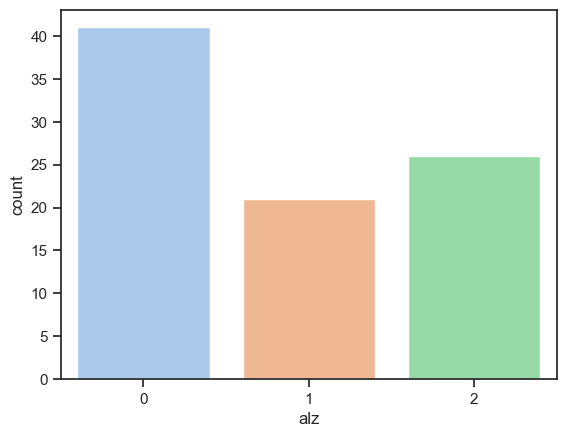
    


```python
# look at incidence of disease by ses
df_ses_2 = df[df['SES']== 2]
df_ses_2.describe()
```


<div>
<style scoped>
    .dataframe tbody tr th:only-of-type {
        vertical-align: middle;
    }

    .dataframe tbody tr th {
        vertical-align: top;
    }

    .dataframe thead th {
        text-align: right;
    }
</style>
<table border="1" class="dataframe">
  <thead>
    <tr style="text-align: right;">
      <th></th>
      <th>alz</th>
      <th>gender</th>
      <th>Age</th>
      <th>EDUC</th>
      <th>SES</th>
      <th>MMSE</th>
      <th>CDR</th>
      <th>nWBV</th>
      <th>ASF</th>
    </tr>
  </thead>
  <tbody>
    <tr>
      <th>count</th>
      <td>103.000000</td>
      <td>103.000000</td>
      <td>103.000000</td>
      <td>103.000000</td>
      <td>103.0</td>
      <td>103.000000</td>
      <td>103.000000</td>
      <td>103.000000</td>
      <td>103.000000</td>
    </tr>
    <tr>
      <th>mean</th>
      <td>0.553398</td>
      <td>1.679612</td>
      <td>76.679612</td>
      <td>15.446602</td>
      <td>2.0</td>
      <td>28.067961</td>
      <td>0.179612</td>
      <td>0.735223</td>
      <td>1.195087</td>
    </tr>
    <tr>
      <th>std</th>
      <td>0.860098</td>
      <td>0.468908</td>
      <td>7.973256</td>
      <td>2.379356</td>
      <td>0.0</td>
      <td>2.836257</td>
      <td>0.319730</td>
      <td>0.034794</td>
      <td>0.142007</td>
    </tr>
    <tr>
      <th>min</th>
      <td>0.000000</td>
      <td>1.000000</td>
      <td>61.000000</td>
      <td>12.000000</td>
      <td>2.0</td>
      <td>18.000000</td>
      <td>0.000000</td>
      <td>0.657000</td>
      <td>0.876000</td>
    </tr>
    <tr>
      <th>25%</th>
      <td>0.000000</td>
      <td>1.000000</td>
      <td>70.500000</td>
      <td>13.000000</td>
      <td>2.0</td>
      <td>28.000000</td>
      <td>0.000000</td>
      <td>0.711500</td>
      <td>1.126000</td>
    </tr>
    <tr>
      <th>50%</th>
      <td>0.000000</td>
      <td>2.000000</td>
      <td>76.000000</td>
      <td>15.000000</td>
      <td>2.0</td>
      <td>29.000000</td>
      <td>0.000000</td>
      <td>0.737000</td>
      <td>1.183000</td>
    </tr>
    <tr>
      <th>75%</th>
      <td>1.000000</td>
      <td>2.000000</td>
      <td>83.000000</td>
      <td>18.000000</td>
      <td>2.0</td>
      <td>30.000000</td>
      <td>0.500000</td>
      <td>0.756500</td>
      <td>1.289500</td>
    </tr>
    <tr>
      <th>max</th>
      <td>2.000000</td>
      <td>2.000000</td>
      <td>95.000000</td>
      <td>20.000000</td>
      <td>2.0</td>
      <td>30.000000</td>
      <td>1.000000</td>
      <td>0.812000</td>
      <td>1.587000</td>
    </tr>
  </tbody>
</table>
</div>


```python
sns.countplot(x=df_ses_2['alz'])
```


    <Axes: xlabel='alz', ylabel='count'>


    
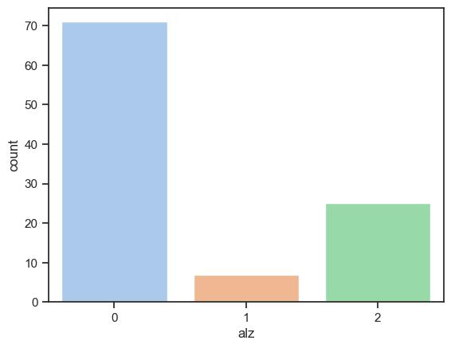
    


```python
# look at incidence of disease by ses
df_ses_3 = df[df['SES']== 3]
df_ses_3.describe()
```


<div>
<style scoped>
    .dataframe tbody tr th:only-of-type {
        vertical-align: middle;
    }

    .dataframe tbody tr th {
        vertical-align: top;
    }

    .dataframe thead th {
        text-align: right;
    }
</style>
<table border="1" class="dataframe">
  <thead>
    <tr style="text-align: right;">
      <th></th>
      <th>alz</th>
      <th>gender</th>
      <th>Age</th>
      <th>EDUC</th>
      <th>SES</th>
      <th>MMSE</th>
      <th>CDR</th>
      <th>nWBV</th>
      <th>ASF</th>
    </tr>
  </thead>
  <tbody>
    <tr>
      <th>count</th>
      <td>82.000000</td>
      <td>82.000000</td>
      <td>82.000000</td>
      <td>82.000000</td>
      <td>82.0</td>
      <td>82.000000</td>
      <td>82.000000</td>
      <td>82.000000</td>
      <td>82.000000</td>
    </tr>
    <tr>
      <th>mean</th>
      <td>0.890244</td>
      <td>1.670732</td>
      <td>77.243902</td>
      <td>13.987805</td>
      <td>3.0</td>
      <td>27.573171</td>
      <td>0.280488</td>
      <td>0.741890</td>
      <td>1.229829</td>
    </tr>
    <tr>
      <th>std</th>
      <td>0.955893</td>
      <td>0.472840</td>
      <td>7.264935</td>
      <td>1.875731</td>
      <td>0.0</td>
      <td>3.212747</td>
      <td>0.369330</td>
      <td>0.039989</td>
      <td>0.124670</td>
    </tr>
    <tr>
      <th>min</th>
      <td>0.000000</td>
      <td>1.000000</td>
      <td>61.000000</td>
      <td>12.000000</td>
      <td>3.0</td>
      <td>15.000000</td>
      <td>0.000000</td>
      <td>0.676000</td>
      <td>0.956000</td>
    </tr>
    <tr>
      <th>25%</th>
      <td>0.000000</td>
      <td>1.000000</td>
      <td>72.000000</td>
      <td>12.000000</td>
      <td>3.0</td>
      <td>27.000000</td>
      <td>0.000000</td>
      <td>0.706250</td>
      <td>1.171000</td>
    </tr>
    <tr>
      <th>50%</th>
      <td>0.000000</td>
      <td>2.000000</td>
      <td>76.000000</td>
      <td>14.000000</td>
      <td>3.0</td>
      <td>29.000000</td>
      <td>0.000000</td>
      <td>0.747000</td>
      <td>1.234000</td>
    </tr>
    <tr>
      <th>75%</th>
      <td>2.000000</td>
      <td>2.000000</td>
      <td>82.000000</td>
      <td>16.000000</td>
      <td>3.0</td>
      <td>29.750000</td>
      <td>0.500000</td>
      <td>0.770000</td>
      <td>1.306000</td>
    </tr>
    <tr>
      <th>max</th>
      <td>2.000000</td>
      <td>2.000000</td>
      <td>92.000000</td>
      <td>18.000000</td>
      <td>3.0</td>
      <td>30.000000</td>
      <td>2.000000</td>
      <td>0.837000</td>
      <td>1.521000</td>
    </tr>
  </tbody>
</table>
</div>


```python
sns.countplot(x=df_ses_3['alz'])
```


    <Axes: xlabel='alz', ylabel='count'>


    
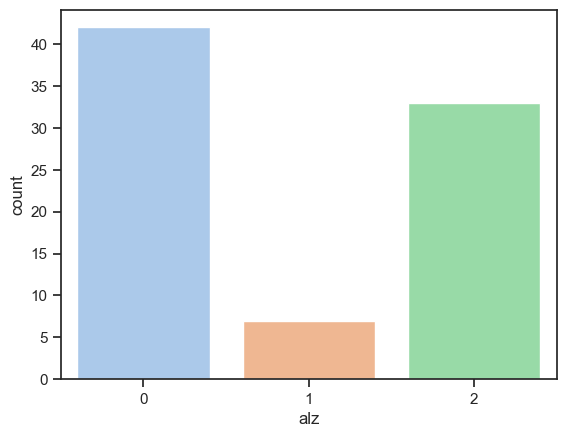
    


```python
# look at incidence of disease by ses
df_ses_4 = df[df['SES']== 4]
df_ses_4.describe()
```


<div>
<style scoped>
    .dataframe tbody tr th:only-of-type {
        vertical-align: middle;
    }

    .dataframe tbody tr th {
        vertical-align: top;
    }

    .dataframe thead th {
        text-align: right;
    }
</style>
<table border="1" class="dataframe">
  <thead>
    <tr style="text-align: right;">
      <th></th>
      <th>alz</th>
      <th>gender</th>
      <th>Age</th>
      <th>EDUC</th>
      <th>SES</th>
      <th>MMSE</th>
      <th>CDR</th>
      <th>nWBV</th>
      <th>ASF</th>
    </tr>
  </thead>
  <tbody>
    <tr>
      <th>count</th>
      <td>74.000000</td>
      <td>74.000000</td>
      <td>74.000000</td>
      <td>74.000000</td>
      <td>74.0</td>
      <td>74.000000</td>
      <td>74.000000</td>
      <td>74.000000</td>
      <td>74.000000</td>
    </tr>
    <tr>
      <th>mean</th>
      <td>1.054054</td>
      <td>1.445946</td>
      <td>76.243243</td>
      <td>11.959459</td>
      <td>4.0</td>
      <td>26.378378</td>
      <td>0.337838</td>
      <td>0.725595</td>
      <td>1.214378</td>
    </tr>
    <tr>
      <th>std</th>
      <td>0.991635</td>
      <td>0.500463</td>
      <td>7.717283</td>
      <td>1.824034</td>
      <td>0.0</td>
      <td>4.202748</td>
      <td>0.352176</td>
      <td>0.038685</td>
      <td>0.121617</td>
    </tr>
    <tr>
      <th>min</th>
      <td>0.000000</td>
      <td>1.000000</td>
      <td>60.000000</td>
      <td>6.000000</td>
      <td>4.0</td>
      <td>15.000000</td>
      <td>0.000000</td>
      <td>0.646000</td>
      <td>0.973000</td>
    </tr>
    <tr>
      <th>25%</th>
      <td>0.000000</td>
      <td>1.000000</td>
      <td>71.000000</td>
      <td>12.000000</td>
      <td>4.0</td>
      <td>25.000000</td>
      <td>0.000000</td>
      <td>0.700000</td>
      <td>1.158250</td>
    </tr>
    <tr>
      <th>50%</th>
      <td>2.000000</td>
      <td>1.000000</td>
      <td>75.000000</td>
      <td>12.000000</td>
      <td>4.0</td>
      <td>28.000000</td>
      <td>0.500000</td>
      <td>0.724000</td>
      <td>1.211500</td>
    </tr>
    <tr>
      <th>75%</th>
      <td>2.000000</td>
      <td>2.000000</td>
      <td>82.750000</td>
      <td>12.000000</td>
      <td>4.0</td>
      <td>29.750000</td>
      <td>0.500000</td>
      <td>0.754750</td>
      <td>1.301750</td>
    </tr>
    <tr>
      <th>max</th>
      <td>2.000000</td>
      <td>2.000000</td>
      <td>90.000000</td>
      <td>16.000000</td>
      <td>4.0</td>
      <td>30.000000</td>
      <td>1.000000</td>
      <td>0.806000</td>
      <td>1.448000</td>
    </tr>
  </tbody>
</table>
</div>


```python
sns.countplot(x=df_ses_4['alz'])
```


    <Axes: xlabel='alz', ylabel='count'>


    
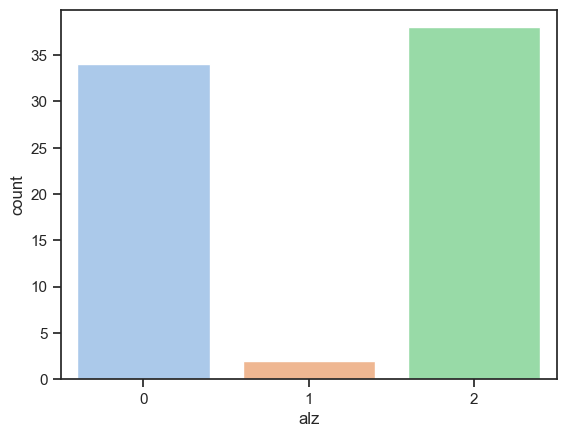
    


```python
# look at incidence of disease by ses
df_ses_5 = df[df['SES']== 5]
df_ses_5.describe()
```


<div>
<style scoped>
    .dataframe tbody tr th:only-of-type {
        vertical-align: middle;
    }

    .dataframe tbody tr th {
        vertical-align: top;
    }

    .dataframe thead th {
        text-align: right;
    }
</style>
<table border="1" class="dataframe">
  <thead>
    <tr style="text-align: right;">
      <th></th>
      <th>alz</th>
      <th>gender</th>
      <th>Age</th>
      <th>EDUC</th>
      <th>SES</th>
      <th>MMSE</th>
      <th>CDR</th>
      <th>nWBV</th>
      <th>ASF</th>
    </tr>
  </thead>
  <tbody>
    <tr>
      <th>count</th>
      <td>7.000000</td>
      <td>7.0</td>
      <td>7.000000</td>
      <td>7.0</td>
      <td>7.0</td>
      <td>7.000000</td>
      <td>7.000000</td>
      <td>7.000000</td>
      <td>7.000000</td>
    </tr>
    <tr>
      <th>mean</th>
      <td>1.428571</td>
      <td>2.0</td>
      <td>78.142857</td>
      <td>8.0</td>
      <td>5.0</td>
      <td>24.285714</td>
      <td>0.428571</td>
      <td>0.722571</td>
      <td>1.314429</td>
    </tr>
    <tr>
      <th>std</th>
      <td>0.975900</td>
      <td>0.0</td>
      <td>3.236694</td>
      <td>0.0</td>
      <td>0.0</td>
      <td>3.638419</td>
      <td>0.345033</td>
      <td>0.031994</td>
      <td>0.150479</td>
    </tr>
    <tr>
      <th>min</th>
      <td>0.000000</td>
      <td>2.0</td>
      <td>73.000000</td>
      <td>8.0</td>
      <td>5.0</td>
      <td>18.000000</td>
      <td>0.000000</td>
      <td>0.682000</td>
      <td>1.199000</td>
    </tr>
    <tr>
      <th>25%</th>
      <td>1.000000</td>
      <td>2.0</td>
      <td>76.500000</td>
      <td>8.0</td>
      <td>5.0</td>
      <td>22.500000</td>
      <td>0.250000</td>
      <td>0.692500</td>
      <td>1.201500</td>
    </tr>
    <tr>
      <th>50%</th>
      <td>2.000000</td>
      <td>2.0</td>
      <td>78.000000</td>
      <td>8.0</td>
      <td>5.0</td>
      <td>25.000000</td>
      <td>0.500000</td>
      <td>0.741000</td>
      <td>1.269000</td>
    </tr>
    <tr>
      <th>75%</th>
      <td>2.000000</td>
      <td>2.0</td>
      <td>80.500000</td>
      <td>8.0</td>
      <td>5.0</td>
      <td>26.500000</td>
      <td>0.500000</td>
      <td>0.747000</td>
      <td>1.397500</td>
    </tr>
    <tr>
      <th>max</th>
      <td>2.000000</td>
      <td>2.0</td>
      <td>82.000000</td>
      <td>8.0</td>
      <td>5.0</td>
      <td>29.000000</td>
      <td>1.000000</td>
      <td>0.756000</td>
      <td>1.535000</td>
    </tr>
  </tbody>
</table>
</div>


```python
sns.barplot(data=df, x = "SES", y='alz')
```


    <Axes: xlabel='SES', ylabel='alz'>


    

    


```python
sns.countplot(x=df_ses_5['alz'])
```


    <Axes: xlabel='alz', ylabel='count'>


    
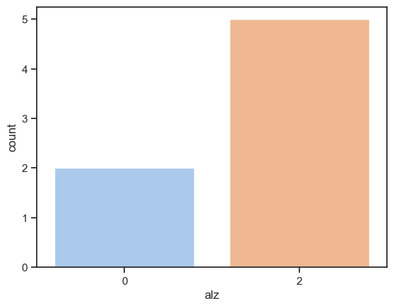
    


```python
sns.countplot(x=df['alz'])
```


    <Axes: xlabel='alz', ylabel='count'>


    
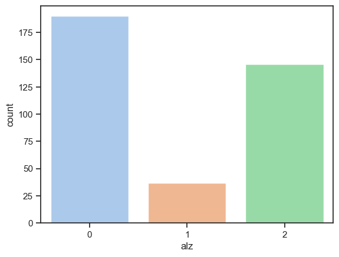
    


```python

```


```python

```


```python
df[ "M/F"].value_counts()
```


    F    213
    M    160
    Name: M/F, dtype: int64


```python
## look a the categorical data more closely--use a proportion plot (normalized histogram)
proportions_group = df['Group'].value_counts(normalize=True)

# Plot the proportions
plt.figure(figsize=(8, 6))
sns.barplot(x=proportions_group.index, y=proportions_group.values)
plt.xlabel('Group')
plt.ylabel('Proportion')
plt.title('Proportion Plot of Group Variable')
plt.show()
```


    
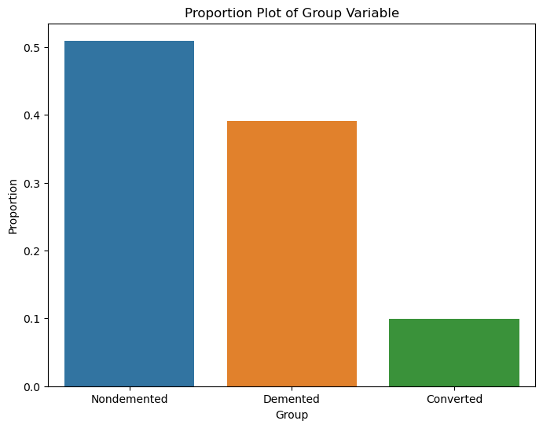
    


```python
proportions_gender = df['M/F'].value_counts(normalize=True)

# Plot the proportions
plt.figure(figsize=(8, 6))
sns.barplot(x=proportions_gender.index, y=proportions_gender.values)

plt.xlabel('Gender')
plt.ylabel('Proportion')
plt.title('Proportion Plot of Gender Variable')
plt.show()
```


    
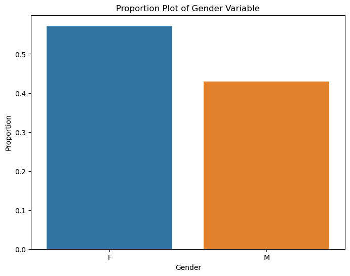
    


```python

```


```python
## filter the Demented Group into a new dataframe
demented_group = df[df["Group"] == "Demented"]
demented_group.columns
demented_group.describe()
```


<div>
<style scoped>
    .dataframe tbody tr th:only-of-type {
        vertical-align: middle;
    }

    .dataframe tbody tr th {
        vertical-align: top;
    }

    .dataframe thead th {
        text-align: right;
    }
</style>
<table border="1" class="dataframe">
  <thead>
    <tr style="text-align: right;">
      <th></th>
      <th>Age</th>
      <th>EDUC</th>
      <th>SES</th>
      <th>MMSE</th>
      <th>CDR</th>
      <th>eTIV</th>
      <th>nWBV</th>
      <th>ASF</th>
    </tr>
  </thead>
  <tbody>
    <tr>
      <th>count</th>
      <td>146.000000</td>
      <td>146.000000</td>
      <td>127.000000</td>
      <td>144.000000</td>
      <td>146.000000</td>
      <td>146.000000</td>
      <td>146.000000</td>
      <td>146.000000</td>
    </tr>
    <tr>
      <th>mean</th>
      <td>76.260274</td>
      <td>13.671233</td>
      <td>2.771654</td>
      <td>24.513889</td>
      <td>0.671233</td>
      <td>1485.849315</td>
      <td>0.716301</td>
      <td>1.196890</td>
    </tr>
    <tr>
      <th>std</th>
      <td>6.940193</td>
      <td>2.898536</td>
      <td>1.196483</td>
      <td>4.497064</td>
      <td>0.296173</td>
      <td>173.769461</td>
      <td>0.031921</td>
      <td>0.137177</td>
    </tr>
    <tr>
      <th>min</th>
      <td>61.000000</td>
      <td>6.000000</td>
      <td>1.000000</td>
      <td>4.000000</td>
      <td>0.500000</td>
      <td>1143.000000</td>
      <td>0.646000</td>
      <td>0.897000</td>
    </tr>
    <tr>
      <th>25%</th>
      <td>71.000000</td>
      <td>12.000000</td>
      <td>2.000000</td>
      <td>22.000000</td>
      <td>0.500000</td>
      <td>1357.000000</td>
      <td>0.694250</td>
      <td>1.120000</td>
    </tr>
    <tr>
      <th>50%</th>
      <td>76.000000</td>
      <td>13.000000</td>
      <td>3.000000</td>
      <td>26.000000</td>
      <td>0.500000</td>
      <td>1476.500000</td>
      <td>0.712000</td>
      <td>1.188500</td>
    </tr>
    <tr>
      <th>75%</th>
      <td>81.000000</td>
      <td>16.000000</td>
      <td>4.000000</td>
      <td>28.000000</td>
      <td>1.000000</td>
      <td>1566.500000</td>
      <td>0.737000</td>
      <td>1.293000</td>
    </tr>
    <tr>
      <th>max</th>
      <td>98.000000</td>
      <td>20.000000</td>
      <td>5.000000</td>
      <td>30.000000</td>
      <td>2.000000</td>
      <td>1957.000000</td>
      <td>0.806000</td>
      <td>1.535000</td>
    </tr>
  </tbody>
</table>
</div>


```python
demented_group.head()
```


<div>
<style scoped>
    .dataframe tbody tr th:only-of-type {
        vertical-align: middle;
    }

    .dataframe tbody tr th {
        vertical-align: top;
    }

    .dataframe thead th {
        text-align: right;
    }
</style>
<table border="1" class="dataframe">
  <thead>
    <tr style="text-align: right;">
      <th></th>
      <th>Group</th>
      <th>M/F</th>
      <th>Age</th>
      <th>EDUC</th>
      <th>SES</th>
      <th>MMSE</th>
      <th>CDR</th>
      <th>eTIV</th>
      <th>nWBV</th>
      <th>ASF</th>
    </tr>
  </thead>
  <tbody>
    <tr>
      <th>2</th>
      <td>Demented</td>
      <td>M</td>
      <td>75</td>
      <td>12</td>
      <td>NaN</td>
      <td>23.0</td>
      <td>0.5</td>
      <td>1678</td>
      <td>0.736</td>
      <td>1.046</td>
    </tr>
    <tr>
      <th>3</th>
      <td>Demented</td>
      <td>M</td>
      <td>76</td>
      <td>12</td>
      <td>NaN</td>
      <td>28.0</td>
      <td>0.5</td>
      <td>1738</td>
      <td>0.713</td>
      <td>1.010</td>
    </tr>
    <tr>
      <th>4</th>
      <td>Demented</td>
      <td>M</td>
      <td>80</td>
      <td>12</td>
      <td>NaN</td>
      <td>22.0</td>
      <td>0.5</td>
      <td>1698</td>
      <td>0.701</td>
      <td>1.034</td>
    </tr>
    <tr>
      <th>10</th>
      <td>Demented</td>
      <td>M</td>
      <td>71</td>
      <td>16</td>
      <td>NaN</td>
      <td>28.0</td>
      <td>0.5</td>
      <td>1357</td>
      <td>0.748</td>
      <td>1.293</td>
    </tr>
    <tr>
      <th>11</th>
      <td>Demented</td>
      <td>M</td>
      <td>73</td>
      <td>16</td>
      <td>NaN</td>
      <td>27.0</td>
      <td>1.0</td>
      <td>1365</td>
      <td>0.727</td>
      <td>1.286</td>
    </tr>
  </tbody>
</table>
</div>


```python
MF_demented = demented_group["M/F"].value_counts()
print(MF_demented)
```

    M    86
    F    60
    Name: M/F, dtype: int64


```python
demented_group["M/F"].value_counts()

# look at the gender dist for the demented group
plt.figure(figsize=(8,6))
sns.barplot(x = MF_demented.index, y = MF_demented.values )
```


    <Axes: >


    
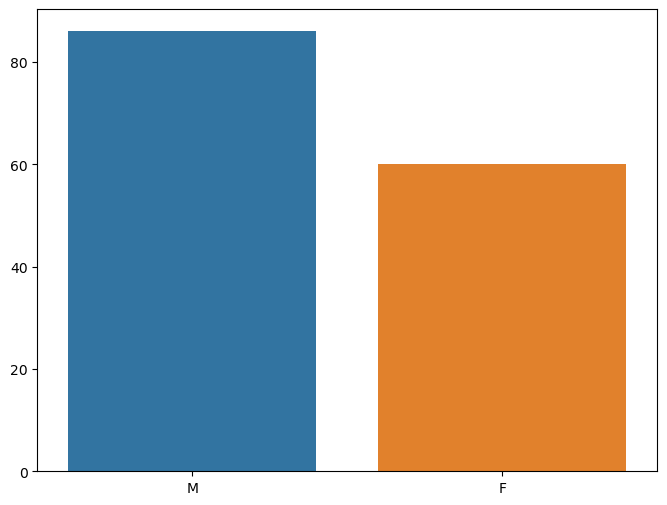
    


```python
# look at the demented group by age
demented_male_count = demented_group['M/F'].value_counts().sum()
print(demented_male_count)
plt.figure(figsize=(20,6))
sns.lineplot(x='Age', y=demented_male_count, data=demented_group[demented_group['M/F']=="M"])
plt.title("Number of demented individuals by age")
plt.show()
```

    146


    
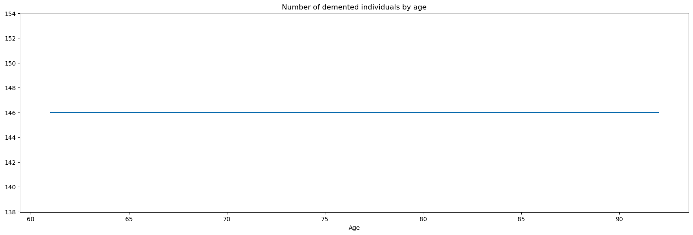
    


```python
# Plot the proportions
plt.figure(figsize=(8, 6))
sns.barplot(x=proportions_gender.index, y=proportions_gender.values, data = df[df['Group']=='Demented'])
plt.xlabel('Gender')
plt.ylabel('Proportion')
plt.title('Plot of Gender Variable')
plt.show()
```


    
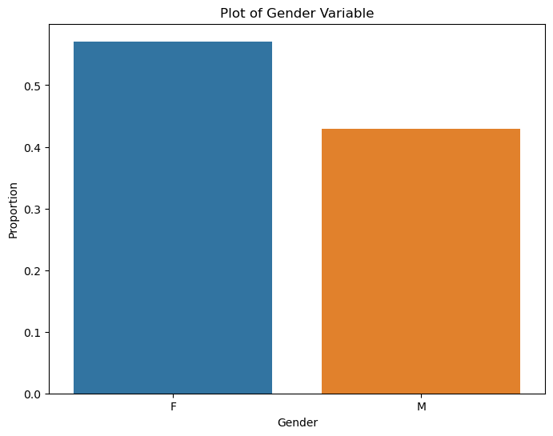
    


```python
# look at the distributions of the columns
cols = len(df.columns)-1
for col in range(2,cols):
    
    plt.figure(figsize=(20,6))
    sns.lineplot(x='Group', y=df.columns[col], data =df)
    plt.hist(df.columns[col])
```


    
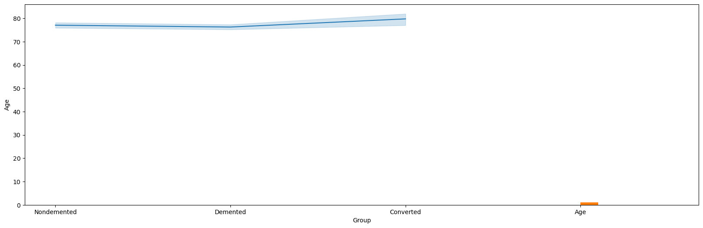
    


    
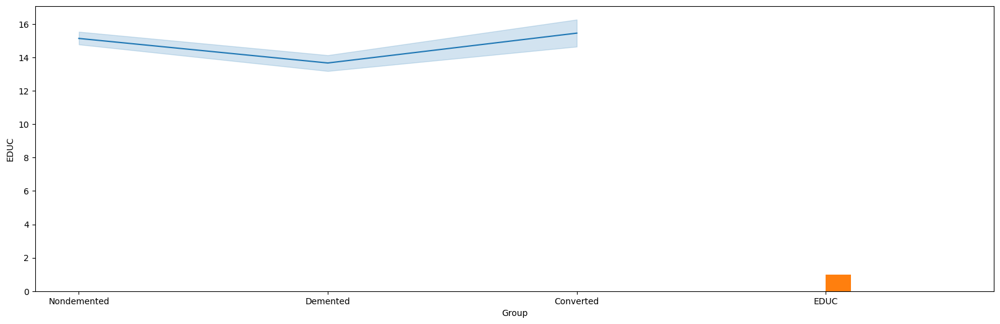
    


    
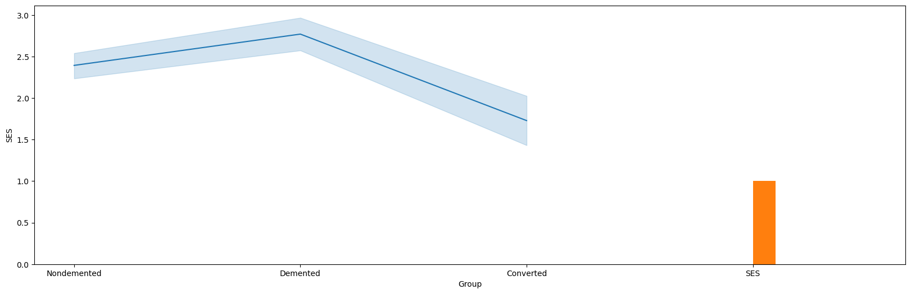
    


    
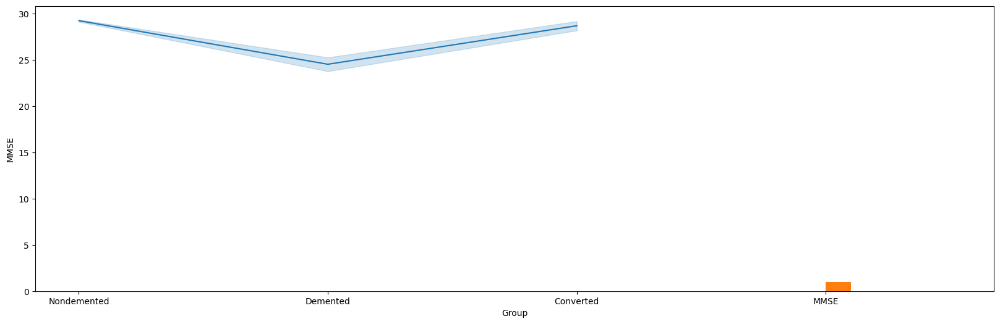
    


    
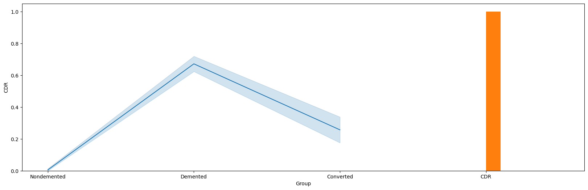
    


    
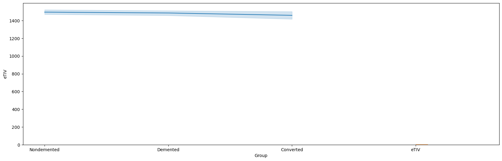
    


    
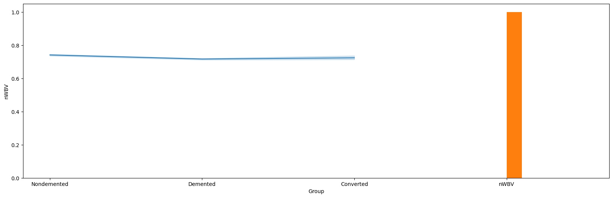
    


```python
# copy the dataframe before altering it
df_original = df.copy()
```

## Pre-processing the data
- convert group 2,1,or 0 and gender to 0's and 1's
- rename group to Alzheimer and M/F to gender for easier interpretation
- fill in missing datavalues with the mean for SES and MMSE


```python
# use the mean to fill in the missing values for socioeconomic status and MMSE
df['SES'].fillna(df['SES'].mean(), inplace=True)
df['MMSE'].fillna(df["MMSE"].mean(), inplace=True)
df.isnull().sum()
```


    Group    0
    M/F      0
    Age      0
    EDUC     0
    SES      0
    MMSE     0
    CDR      0
    eTIV     0
    nWBV     0
    ASF      0
    dtype: int64


```python
# rename group to Alz
df.rename(columns = {'Group':'alz'}, inplace=True)
df.head()
```


<div>
<style scoped>
    .dataframe tbody tr th:only-of-type {
        vertical-align: middle;
    }

    .dataframe tbody tr th {
        vertical-align: top;
    }

    .dataframe thead th {
        text-align: right;
    }
</style>
<table border="1" class="dataframe">
  <thead>
    <tr style="text-align: right;">
      <th></th>
      <th>alz</th>
      <th>M/F</th>
      <th>Age</th>
      <th>EDUC</th>
      <th>SES</th>
      <th>MMSE</th>
      <th>CDR</th>
      <th>eTIV</th>
      <th>nWBV</th>
      <th>ASF</th>
    </tr>
  </thead>
  <tbody>
    <tr>
      <th>0</th>
      <td>Nondemented</td>
      <td>M</td>
      <td>87</td>
      <td>14</td>
      <td>2.000000</td>
      <td>27.0</td>
      <td>0.0</td>
      <td>1987</td>
      <td>0.696</td>
      <td>0.883</td>
    </tr>
    <tr>
      <th>1</th>
      <td>Nondemented</td>
      <td>M</td>
      <td>88</td>
      <td>14</td>
      <td>2.000000</td>
      <td>30.0</td>
      <td>0.0</td>
      <td>2004</td>
      <td>0.681</td>
      <td>0.876</td>
    </tr>
    <tr>
      <th>2</th>
      <td>Demented</td>
      <td>M</td>
      <td>75</td>
      <td>12</td>
      <td>2.460452</td>
      <td>23.0</td>
      <td>0.5</td>
      <td>1678</td>
      <td>0.736</td>
      <td>1.046</td>
    </tr>
    <tr>
      <th>3</th>
      <td>Demented</td>
      <td>M</td>
      <td>76</td>
      <td>12</td>
      <td>2.460452</td>
      <td>28.0</td>
      <td>0.5</td>
      <td>1738</td>
      <td>0.713</td>
      <td>1.010</td>
    </tr>
    <tr>
      <th>4</th>
      <td>Demented</td>
      <td>M</td>
      <td>80</td>
      <td>12</td>
      <td>2.460452</td>
      <td>22.0</td>
      <td>0.5</td>
      <td>1698</td>
      <td>0.701</td>
      <td>1.034</td>
    </tr>
  </tbody>
</table>
</div>


```python
df['alz'].value_counts()
```


    Nondemented    190
    Demented       146
    Converted       37
    Name: alz, dtype: int64


```python
''' Since there are three different categories in the data (demented and converted both have Alz, but the converted 
are more recently identified the severity of symptoms should be lesser than the demented group), so I will
use three different groups 2-demented, 1-converted, 0, nondemented '''

```


    ' Since there are three different categories in the data (demented and converted both have Alz, but the converted \nare more recently identified the severity of symptoms should be lesser than the demented group), so I will\nuse three different groups 2-demented, 1-converted, 0, nondemented '


```python
df['alz'] = df['alz'].replace({'Demented': 2, 'Converted': 1, 'Nondemented':0})
```


```python
df['alz'].value_counts()
```


    0    190
    2    146
    1     37
    Name: alz, dtype: int64


```python
# rename column M/F to gender 
df.rename(columns = {'M/F': 'gender'}, inplace = True)
```


```python
# Change gender to numeric (Male =1 , Female = 2)
df['gender']=df['gender'].replace({'M': 1, 'F': 2})
df['gender'].value_counts()
```


    2    213
    1    160
    Name: gender, dtype: int64


```python
# Draw a nested barplot by group and gender
g = sns.catplot(data=df, kind="bar", x="alz", y="EDUC", hue="gender",
    errorbar="sd", height=6)
g.despine(left=True)
g.set_axis_labels("Group: 0-Nondemented, 1-Converted, 2-Demented)", "Education Level")
```


    <seaborn.axisgrid.FacetGrid at 0x151c732b0>


    
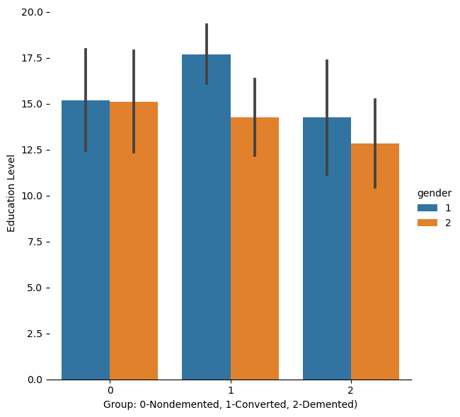
    


```python
# look at the MMSE scores by group in a nested bar plot
g2 = sns.catplot(data = df, kind='bar', x='alz', y='MMSE', hue="gender",errorbar="sd")
g2.set_axis_labels("Group: 0-Nondemented, 1-Converted, 2-Demented)", "Education Level")
```


    <seaborn.axisgrid.FacetGrid at 0x151c73880>


    

    


```python
# look at the SES by group
g3= sns.catplot(data = df, kind='bar', x='alz', y='SES',hue='gender',errorbar="sd")
g3.set_axis_labels("Group: 0-Nondemented, 1-Converted, 2-Demented)", "Socioeconomic Status")
```


    <seaborn.axisgrid.FacetGrid at 0x157002890>


    
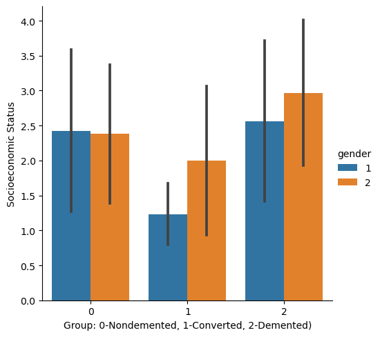
    


```python
# look at Normalized Whole Brain Volume by group
g4=sns.catplot(data = df, kind='bar', x="alz", y='ASF', hue = 'gender', errorbar='sd')
g4.set_axis_labels("Group: 0-Nondemented, 1-Converted, 2-Demented)", "Atlas Scaling Factor")
```


    <seaborn.axisgrid.FacetGrid at 0x1570a2680>


    
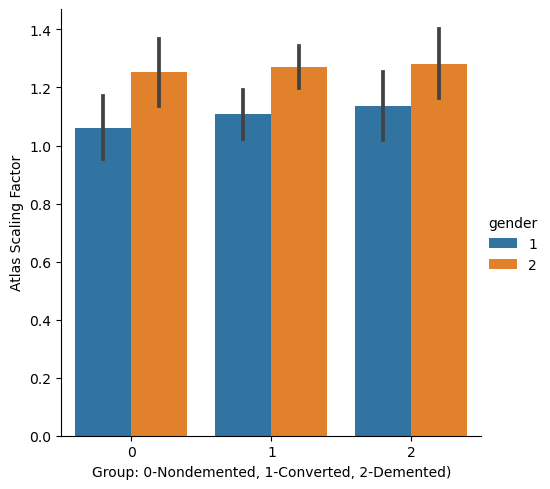
    


```python
sns.set_theme(style="ticks", palette="pastel")

# Load the example tips dataset
tips = sns.load_dataset("tips")

# Draw a nested boxplot to show bills by day and time
sns.boxplot(x="alz", y="Age", hue="gender", data=df)
sns.despine(offset=10, trim=True)
```


    
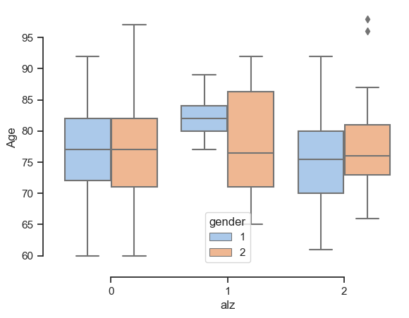
    


```python

```


```python

```


```python

```


```python

```


```python

```


```python
# look at correlation matrix
plt.figure(figsize=(12,9))
sns.heatmap(df.corr(), annot=True)

```


    <Axes: >


    
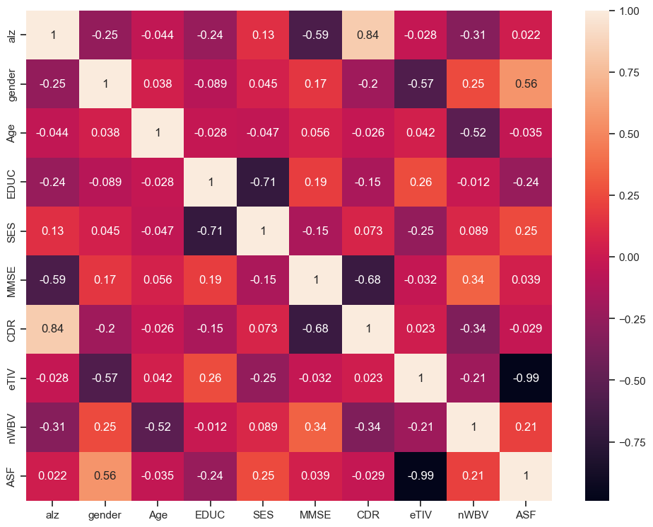
    


```python
df['MMSE'].value_counts()
```


    30.000000    114
    29.000000     91
    28.000000     45
    27.000000     32
    26.000000     20
    25.000000     12
    21.000000     11
    23.000000     11
    22.000000      7
    20.000000      7
    17.000000      5
    24.000000      4
    16.000000      3
    19.000000      3
    15.000000      2
    18.000000      2
    27.342318      2
    7.000000       1
    4.000000       1
    Name: MMSE, dtype: int64


```python
# Since ASF and eTIV both are measuring intercranial volume, it is expected that the two measures are highly correlated
# drop CDR since the clinical dementia rating is not a factor in developing alz
# drop eTIV from the dataset
df=df.drop('eTIV', axis =1)
```


```python
# split the data into features and target variable
X = df.iloc[:, 1:]
y = df.iloc[:, 0]
```

### Split the data into training and test sets


```python
X_train, X_test, y_train, y_test = train_test_split(X, y, random_state =12)
```


```python
scaler = StandardScaler().fit(X_train)
```


```python
scaler.mean_, scaler.scale_
```


    (array([ 1.58781362, 77.18637993, 14.59856631,  2.435575  , 27.2879653 ,
             0.30107527,  0.72869534,  1.19205376]),
     array([0.49222837, 7.67725035, 2.96517386, 1.10328729, 3.66567992,
            0.38895908, 0.03748917, 0.13207289]))


```python
# Transform the values to std normal
X_train_scaled = scaler.transform(X_train)
```


```python

```


```python
X_train_scaled.mean(axis =0)
```


    array([ 5.09349631e-17, -7.64024447e-16,  3.66095048e-17, -9.55030559e-18,
           -3.05609779e-16,  1.43254584e-17,  8.75444679e-16, -9.93231781e-16])


### First run each model with the standard hyperparameters and compare the accuracy of our models


```python
classifiers = {
    'lg': LogisticRegression(),
    'dt': DecisionTreeClassifier(),
    'rf': RandomForestClassifier(),
    'xgb': GradientBoostingClassifier(),
    'svc': SVC(),
    'knn': KNeighborsClassifier()
}

```

### Apply each algorithm using 5-fold cross validation with each classifier


```python
for name, classifier in classifiers.items():
    scores = cross_validate(classifier, X_train_scaled, y_train, cv=5, scoring='accuracy')
    print(f'{name} - Mean Accuracy: {scores["test_score"].mean()}')
```

    lg - Mean Accuracy: 0.8888311688311689
    dt - Mean Accuracy: 0.8101948051948051
    rf - Mean Accuracy: 0.8924675324675325
    xgb - Mean Accuracy: 0.8781818181818182
    svc - Mean Accuracy: 0.8816233766233765
    knn - Mean Accuracy: 0.846038961038961


```python
for name, classifier in classifiers.items():
    # Create a pipeline with the classifier
    pipeline = Pipeline([('classifier', classifier)])

    # Fit the pipeline on the training data
    pipeline.fit(X_train_scaled, y_train)

# Retrieve feature importances
    if hasattr(classifier, 'feature_importances_'):
        importances = classifier.feature_importances_
    elif hasattr(classifier, 'coef_'):
        importances = classifier.coef_[0]
    else:
        importances = None

    # Print feature importances
    if importances is not None:
        for feature, importance in zip(X_train.columns, importances):
            print(f"{name} - Feature: {feature}, Importance: {importance}")
        print()
    else:
        print(f"{name} - Feature importances not available for this classifier.\n")

```

    lg - Feature: gender, Importance: 0.428214187943041
    lg - Feature: Age, Importance: 0.21290984810644142
    lg - Feature: EDUC, Importance: 0.5025394919568976
    lg - Feature: SES, Importance: 0.5786273455230686
    lg - Feature: MMSE, Importance: 0.625888941647989
    lg - Feature: CDR, Importance: -2.600697415062562
    lg - Feature: nWBV, Importance: 0.1898153126864174
    lg - Feature: ASF, Importance: -0.5058279412098533
    
    dt - Feature: gender, Importance: 0.006059421422986708
    dt - Feature: Age, Importance: 0.06407820181335404
    dt - Feature: EDUC, Importance: 0.02315552284277851
    dt - Feature: SES, Importance: 0.041485717645784875
    dt - Feature: MMSE, Importance: 0.04631390776045318
    dt - Feature: CDR, Importance: 0.6328760068009481
    dt - Feature: nWBV, Importance: 0.05100999588293416
    dt - Feature: ASF, Importance: 0.13502122583076032
    
    rf - Feature: gender, Importance: 0.029184680868674255
    rf - Feature: Age, Importance: 0.07799461372239684
    rf - Feature: EDUC, Importance: 0.05636506979530276
    rf - Feature: SES, Importance: 0.05286510802851544
    rf - Feature: MMSE, Importance: 0.20525589978205536
    rf - Feature: CDR, Importance: 0.36692127671545893
    rf - Feature: nWBV, Importance: 0.10490205565295935
    rf - Feature: ASF, Importance: 0.10651129543463704
    
    xgb - Feature: gender, Importance: 0.006910042733776396
    xgb - Feature: Age, Importance: 0.05659475151364662
    xgb - Feature: EDUC, Importance: 0.01914352569453447
    xgb - Feature: SES, Importance: 0.03933861031408421
    xgb - Feature: MMSE, Importance: 0.031170280398331914
    xgb - Feature: CDR, Importance: 0.6980442097889772
    xgb - Feature: nWBV, Importance: 0.04507594829659841
    xgb - Feature: ASF, Importance: 0.10372263126005081
    
    svc - Feature importances not available for this classifier.
    
    knn - Feature importances not available for this classifier.
    


### We will now use GridSearch to tune the hyperparameters to optimize each model


```python
from sklearn.model_selection import GridSearchCV
```

### Logistic Regression model hyperparameters: 
- penalty: This hyperparameter determines the type of regularization applied to the model. Regularization helps prevent overfitting by adding a penalty term to the loss function. The two common options for penalty are "l1" (L1 regularization, also known as Lasso) and "l2" (L2 regularization, also known as Ridge). The default value is "l2".

- C: The C hyperparameter controls the inverse of the regularization strength. Smaller values of C result in stronger regularization, while larger values result in weaker regularization. It affects the balance between fitting the training data well and preventing overfitting. The default value is 1.0.

- solver: This hyperparameter determines the algorithm used to optimize the model's weights. Different solvers have different computational properties and are suitable for different types of problems. Common options include "lbfgs" (Limited-memory Broyden-Fletcher-Goldfarb-Shanno), "liblinear", "newton-cg", "sag" (Stochastic Average Gradient), and "saga". The default solver is "lbfgs", which works well for small-to-medium-sized datasets. "liblinear" is recommended for smaller datasets, while "sag" and "saga" are efficient for large-scale problems.

- max_iter: This hyperparameter specifies the maximum number of iterations for the solver to converge. The solver iteratively updates the model's parameters until convergence or until the maximum number of iterations is reached. If the convergence warning appears, it means that the solver did not converge within the specified number of iterations. You may need to increase the value of max_iter if convergence is not achieved.


```python
# Define the Logistic Regression hyperparameter grid
param_grid_lg = {
    'C': [0.1, 1, 10],
    'penalty': ['l1', 'l2'],
    'solver': ['liblinear', 'saga']
}

# Perform the Grid Search 
grid_search_lg = GridSearchCV(LogisticRegression(max_iter=2000), param_grid_lg, cv = 5, scoring='accuracy')
grid_search_lg.fit(X_train_scaled, y_train) 

# Add the gridsearch parameters to a dictionary
best_params_lg = grid_search_lg.best_params_

print("Best hyperparameter for logistic regression: ", best_params_lg)
print("Best Score for logistic regression: ", grid_search_lg.best_score_)
```

    Best hyperparameter for logistic regression:  {'C': 10, 'penalty': 'l1', 'solver': 'liblinear'}
    Best Score for logistic regression:  0.8888961038961039


### Decision Tree Classifier hyperparameters
- criterion: This hyperparameter specifies the criterion used to measure the quality of a split. It can be either "gini" for the Gini impurity or "entropy" for information gain. The default value is "gini".

- max_depth: It determines the maximum depth of the decision tree. Setting a maximum depth helps to control overfitting. The default value is None, which means the tree will expand until all leaves are pure or until all leaves contain less than min_samples_split samples.

- min_samples_split: This hyperparameter sets the minimum number of samples required to split an internal node. If the number of samples is less than this value, the split is not performed. Increasing this value can prevent overfitting. The default value is 2.

- min_samples_leaf: It sets the minimum number of samples required to be at a leaf node. If a split results in a leaf node with fewer samples than this value, the split is not performed. Increasing this value can prevent overfitting. The default value is 1.

- max_features: It determines the number of features to consider when looking for the best split. It can be an integer, float, or "sqrt" (square root of the total number of features) or "log2" (logarithm base 2 of the total number of features). The default value is None, which means all features are considered.

- min_impurity_decrease: This hyperparameter specifies the threshold for a split to be considered significant. A split will only be performed if it results in a decrease of impurity greater than or equal to this value. The default value is 0.

Each hyperparameter affects the complexity and behavior of the decision tree, and tuning these hyperparameters can help optimize the model's performance and prevent overfitting.


```python
# Define the Decision Tree hyperparameter grid
param_grid_dt = {
    'criterion': ['gini', 'entropy'],
    'max_depth': [3, 5, 7],
    'min_samples_split': [2, 5, 10],
    'min_samples_leaf': [1, 3, 5]
}

# Perform grid search
grid_search_dt = GridSearchCV(DecisionTreeClassifier(), param_grid=param_grid_dt, cv=5, scoring='accuracy')
grid_search_dt.fit(X_train_scaled, y_train )

# Add the gridsearch parameters to a dictionary
best_params_dt = grid_search_dt.best_params_


print("Best hyperparameter for decision tree classifier: ", best_params_dt)
print("Best Score for decision tree classifier: ", grid_search_dt.best_score_)
```

    Best hyperparameter for decision tree classifier:  {'criterion': 'entropy', 'max_depth': 5, 'min_samples_leaf': 5, 'min_samples_split': 2}
    Best Score for decision tree classifier:  0.8853246753246753


### Random Forest Classifier hyperparameters

- n_estimators: This hyperparameter sets the number of decision trees in the random forest. Increasing the number of trees can improve the performance of the model, but it also increases the computational cost. It is recommended to choose a value that is large enough to stabilize the performance but not excessively large to avoid overfitting.

- criterion: It specifies the criterion used to measure the quality of a split in each decision tree. The two commonly used options are "gini" for the Gini impurity and "entropy" for information gain. The default value is "gini".

- max_depth: This hyperparameter determines the maximum depth of each decision tree in the random forest. It helps control overfitting by limiting the depth of the trees. The default value is None, which means the trees will expand until all leaves are pure or until all leaves contain less than min_samples_split samples.

- min_samples_split: It sets the minimum number of samples required to split an internal node in each decision tree. If the number of samples is less than this value, the split is not performed. Increasing this value can prevent overfitting. The default value is 2.

- min_samples_leaf: This hyperparameter sets the minimum number of samples required to be at a leaf node in each decision tree. If a split results in a leaf node with fewer samples than this value, the split is not performed. Increasing this value can prevent overfitting. The default value is 1.

- max_features: It determines the number of features to consider when looking for the best split in each decision tree. It can be an integer, float, or "sqrt" (square root of the total number of features) or "log2" (logarithm base 2 of the total number of features). The default value is "auto", which is equivalent to "sqrt".

- bootstrap: This hyperparameter controls whether bootstrap samples are used when building each decision tree. If set to True, each tree is trained on a random subset of the training data with replacement. If set to False, the entire training dataset is used to build each tree. The default value is True


```python
param_grid_rf = {
    'n_estimators': [100, 200, 300],
    'max_depth': [None, 5, 10],
    'min_samples_split': [2, 5, 10],
    'min_samples_leaf': [1, 2, 4],
}

grid_search_rf = GridSearchCV(RandomForestClassifier(), param_grid=param_grid_rf, scoring='accuracy')
grid_search_rf.fit(X_train_scaled, y_train)

# Add the gridsearch parameters to a dictionary
best_params_rf = grid_search_rf.best_params_

print("Best hyperparameter for random forest classifier: ", best_params_rf)
print("Best Score for random forest classifier: ", grid_search_rf.best_score_)
```

    Best hyperparameter for random forest classifier:  {'max_depth': None, 'min_samples_leaf': 1, 'min_samples_split': 2, 'n_estimators': 300}
    Best Score for random forest classifier:  0.8924675324675325


### XG Boost hyperparameters
- n_estimators: It determines the number of boosting rounds or decision trees to be built. Increasing the number of estimators may improve performance, but it also increases the training time.

- learning_rate: This controls the contribution of each tree in the ensemble. A smaller learning rate will require more trees to be added to the ensemble, potentially leading to a more accurate model but increasing training time. A larger learning rate can make the model converge faster but might lead to overfitting.

- max_depth: It defines the maximum depth of each decision tree in the ensemble. Deeper trees can learn more complex relationships in the data but can also lead to overfitting. It is advisable to tune this parameter to find the optimal balance.

- subsample: It specifies the fraction of samples to be used for training each tree. A value less than 1.0 can introduce randomness and prevent overfitting. Values closer to 1.0 use a larger portion of the dataset for training, potentially leading to better performance.


```python
param_grid_xgb = {
    'n_estimators': [100, 200, 300],
    'learning_rate': [0.1, 0.01, 0.001],
    'max_depth': [3, 5, 7],
    'subsample': [0.8, 1.0],
}

grid_search_xgb = GridSearchCV(GradientBoostingClassifier(), param_grid=param_grid_xgb, scoring='accuracy')
grid_search_xgb.fit(X_train_scaled, y_train)

# Add the gridsearch parameters to a dictionary
best_params_xgb = grid_search_xgb.best_params_

print("Best hyperparameter for XG Boost classifier: ", best_params_xgb)
print("Best Score for XG Boost classifier: ", grid_search_xgb.best_score_) 
```

    Best hyperparameter for XG Boost classifier:  {'learning_rate': 0.1, 'max_depth': 5, 'n_estimators': 200, 'subsample': 1.0}
    Best Score for XG Boost classifier:  0.9033116883116883


#### Support Vector Classifier (SVC) model hyperparameters:
- C: It controls the regularization parameter, which determines the trade-off between maximizing the margin and minimizing the training errors. Higher values of C lead to less regularization, potentially allowing the model to fit the training data more closely. Lower values of C increase the regularization, encouraging the model to generalize better to unseen data.
- gamma: It is a parameter for the RBF (Radial Basis Function) kernel and controls the influence of each training sample. It defines how far the influence of a single training example reaches. Higher values of gamma result in the model fitting the training data more precisely, potentially leading to overfitting. Lower values of gamma make the model's decision boundary smoother and may lead to underfitting.
- kernel: It specifies the kernel function used for the decision function. The 'linear' kernel represents a linear decision boundary.


```python
# Define the SVC hyperparameter grid for Grid Search
param_grid_svc = {
    'C': [0.1, 1, 10],
    'kernel': ['linear', 'rbf'],
    'gamma': [0.1, 1, 10]
}

# Perform Grid Search cross-validation
grid_search_svc = GridSearchCV(SVC(), param_grid_svc, cv=5)
grid_search_svc.fit(X_train_scaled, y_train)  


# Add the gridsearch parameters to a dictionary
best_params_svc = grid_search_svc.best_params_

# Print the best hyperparameters and score
print("Best Hyperparameters for SVC:", best_params_svc)
print("Best Score for SVC:", grid_search_svc.best_score_)
```

    Best Hyperparameters for SVC: {'C': 10, 'gamma': 0.1, 'kernel': 'rbf'}
    Best Score for SVC: 0.896038961038961


### KNN Classifier hyperparameters
- n_neighbors: The number of neighbors to consider when making predictions. This parameter determines the size of the neighborhood used to classify a new data point. Higher values make the model more robust to noise but may smooth out decision boundaries too much.

- weights: The weight function used in prediction. It can be set to 'uniform', where all points in each neighborhood are weighted equally, or 'distance', where closer neighbors have a higher influence than distant ones.

- metric: The distance metric used to calculate distances between data points. Common options include 'euclidean', 'manhattan', and 'minkowski'. The choice of distance metric depends on the data and the problem at hand.


```python
param_grid_knn = {
    'n_neighbors': [3, 5, 7],
    'weights': ['uniform', 'distance'],
    'metric': ['euclidean', 'manhattan']
}

# Perform Grid Search cross-validation
grid_search_knn = GridSearchCV(KNeighborsClassifier(), param_grid_knn, cv=5)
grid_search_knn.fit(X_train_scaled, y_train)  

# Add the gridsearch parameters to a dictionary
best_params_knn = grid_search_knn.best_params_

# Print the best hyperparameters and score
print("Best Hyperparameters for KNN:", best_params_knn)
print("Best Score for KNN:", grid_search_knn.best_score_)

```

    Best Hyperparameters for KNN: {'metric': 'euclidean', 'n_neighbors': 3, 'weights': 'distance'}
    Best Score for KNN: 0.8996103896103896


## Create pipeline for optimized classifiers after GridSearch


```python
classifiers_optimized = {
    'lg': LogisticRegression(C = best_params_lg['C'], penalty=best_params_lg['penalty'], 
                             solver=best_params_lg['solver']),
    'dt': DecisionTreeClassifier(criterion=best_params_dt['criterion'], 
                                 max_depth=best_params_dt['max_depth'], 
                                 min_samples_leaf=best_params_dt['min_samples_leaf'],
                                 min_samples_split=best_params_dt['min_samples_split']),
    'rf': RandomForestClassifier(max_depth=best_params_rf['max_depth'], 
                                 min_samples_leaf=best_params_rf['min_samples_leaf'],
                                 min_samples_split=best_params_rf['min_samples_split'],
                                 n_estimators=best_params_rf['n_estimators']),
    'xgb': GradientBoostingClassifier(learning_rate=best_params_xgb['learning_rate'],
                                      max_depth=best_params_xgb['max_depth'],
                                      n_estimators=best_params_xgb['n_estimators'],
                                      subsample=best_params_xgb['subsample']),
    'svc': SVC(C=best_params_svc['C'], gamma=best_params_svc['gamma'], kernel=best_params_svc['kernel']),
    'knn': KNeighborsClassifier(metric = best_params_knn['metric'], n_neighbors = best_params_knn['n_neighbors'],
                                                         weights = best_params_knn['weights'])
}

```


```python

```

## Perform cross validation for each classifier with optimized hyperparameters


```python
for name, classifier in classifiers_optimized.items():
    scores = cross_validate(classifier, X_train_scaled, y_train, cv=5, scoring='accuracy')
    print(f'{name} - Optimized Mean Accuracy: {scores["test_score"].mean()}')
```

    lg - Optimized Mean Accuracy: 0.8888961038961039
    dt - Optimized Mean Accuracy: 0.8817532467532467
    rf - Optimized Mean Accuracy: 0.8924675324675325
    xgb - Optimized Mean Accuracy: 0.8997402597402597
    svc - Optimized Mean Accuracy: 0.896038961038961
    knn - Optimized Mean Accuracy: 0.8996103896103896


### Now that we have completed the 5-fold cross-validation across the dataset and then hypertuned the parameters using GridSearch, we will split the data again into a new training and test split and compare the hypertuned algorithms

### Plan of action: 
1. Split the data into training and test
2. Rescale the data with StandardScaler
3. Train each optimized model with the new training data
4. Evaluate each model: consider
- accuracy
- F1 score
- recall
- precision


```python
# Split the data into training and test sets
X2_train, X2_test, y2_train, y2_test = train_test_split(X, y, random_state =42)
```


```python
# Rescale the data
scaler2 = StandardScaler()
scaler2.fit(X2_train)
X2_train_scaled = scaler2.transform(X2_train)
scaler2.fit(X2_test)
X2_test_scaled = scaler2.transform(X2_test)
```


```python
# run each optimized algorithm on the new training data; produce accuracy and F1 scores
for name, classifier in classifiers_optimized.items():
    
    classifier.fit(X2_train_scaled, y2_train)
    y_pred = classifier.predict(X2_test_scaled)
    y_true = y2_test
    precision = precision_score(y_true, y_pred, average='micro')
    recall = recall_score(y_true, y_pred, average='micro')

    # Print the scores
    accuracy = accuracy_score(y2_test, y_pred)
    print(f"Summary for the {name} algorithm")
    print(f"   Accuracy: {accuracy}")
    f1 = f1_score(y2_test, y_pred, average='weighted')
    print(f'   F1 Score: {f1}')
    print(f"   Precision: {precision}")
    print(f"   Recall: {recall}\n")
    
```

    Summary for the lg algorithm
       Accuracy: 0.8617021276595744
       F1 Score: 0.8030777881601906
       Precision: 0.8617021276595744
       Recall: 0.8617021276595744
    
    Summary for the dt algorithm
       Accuracy: 0.8297872340425532
       F1 Score: 0.7865820178448868
       Precision: 0.8297872340425532
       Recall: 0.8297872340425532
    
    Summary for the rf algorithm
       Accuracy: 0.8617021276595744
       F1 Score: 0.8030777881601906
       Precision: 0.8617021276595744
       Recall: 0.8617021276595744
    
    Summary for the xgb algorithm
       Accuracy: 0.8723404255319149
       F1 Score: 0.8491695459780565
       Precision: 0.8723404255319149
       Recall: 0.8723404255319149
    
    Summary for the svc algorithm
       Accuracy: 0.8404255319148937
       F1 Score: 0.8070305272895468
       Precision: 0.8404255319148937
       Recall: 0.8404255319148937
    
    Summary for the knn algorithm
       Accuracy: 0.8617021276595744
       F1 Score: 0.8429426754231494
       Precision: 0.8617021276595744
       Recall: 0.8617021276595744
    


## The best algorithm overall for classifying the individuals baed on the test data was the optimized Gradient Boost algorithm.

Compare the data in this group to the 2010 publication Predicting Conversion to Dementia of the Alzheimer Type in a Healthy Control Sample: The Power of Errors in Stroop Color Naming

Redo the gradient boost to examine feature importances


```python
# Creating an instance of the XGBoost model to 
xgb_model = GradientBoostingClassifier()
  # Change the model class according to your task (classification/regression)

# Fitting the model to the data
xgb_model.fit(X2_train, y2_train)

# Accessing feature importance
importance = xgb_model.feature_importances_

# Creating a dataframe to display the feature importance values
feature_importance_xgb = pd.DataFrame({'Feature': X2_train.columns, 'Importance': importance})
feature_importance_xgb = feature_importance_xgb.sort_values('Importance', ascending=False)

print(feature_importance_xgb)
```

      Feature  Importance
    5     CDR    0.750592
    7     ASF    0.065857
    1     Age    0.047269
    6    nWBV    0.041545
    2    EDUC    0.039655
    4    MMSE    0.033445
    3     SES    0.019387
    0  gender    0.002251


```python

```


```python

```


```python

```


```python
# Look at individuals that converted from nondemented (2010--67%)
converted_df =  df[df['alz']==1]
```


```python
converted_df.describe()
```


<div>
<style scoped>
    .dataframe tbody tr th:only-of-type {
        vertical-align: middle;
    }

    .dataframe tbody tr th {
        vertical-align: top;
    }

    .dataframe thead th {
        text-align: right;
    }
</style>
<table border="1" class="dataframe">
  <thead>
    <tr style="text-align: right;">
      <th></th>
      <th>alz</th>
      <th>gender</th>
      <th>Age</th>
      <th>EDUC</th>
      <th>SES</th>
      <th>MMSE</th>
      <th>CDR</th>
      <th>nWBV</th>
      <th>ASF</th>
    </tr>
  </thead>
  <tbody>
    <tr>
      <th>count</th>
      <td>37.0</td>
      <td>37.000000</td>
      <td>37.000000</td>
      <td>37.000000</td>
      <td>37.00000</td>
      <td>37.000000</td>
      <td>37.000000</td>
      <td>37.00000</td>
      <td>37.000000</td>
    </tr>
    <tr>
      <th>mean</th>
      <td>1.0</td>
      <td>1.648649</td>
      <td>79.756757</td>
      <td>15.459459</td>
      <td>1.72973</td>
      <td>28.675676</td>
      <td>0.256757</td>
      <td>0.72373</td>
      <td>1.212405</td>
    </tr>
    <tr>
      <th>std</th>
      <td>0.0</td>
      <td>0.483978</td>
      <td>7.425203</td>
      <td>2.523166</td>
      <td>0.96173</td>
      <td>1.564432</td>
      <td>0.253356</td>
      <td>0.03543</td>
      <td>0.109295</td>
    </tr>
    <tr>
      <th>min</th>
      <td>1.0</td>
      <td>1.000000</td>
      <td>65.000000</td>
      <td>12.000000</td>
      <td>1.00000</td>
      <td>24.000000</td>
      <td>0.000000</td>
      <td>0.66600</td>
      <td>1.019000</td>
    </tr>
    <tr>
      <th>25%</th>
      <td>1.0</td>
      <td>1.000000</td>
      <td>74.000000</td>
      <td>14.000000</td>
      <td>1.00000</td>
      <td>28.000000</td>
      <td>0.000000</td>
      <td>0.69600</td>
      <td>1.106000</td>
    </tr>
    <tr>
      <th>50%</th>
      <td>1.0</td>
      <td>2.000000</td>
      <td>81.000000</td>
      <td>16.000000</td>
      <td>1.00000</td>
      <td>29.000000</td>
      <td>0.500000</td>
      <td>0.71800</td>
      <td>1.234000</td>
    </tr>
    <tr>
      <th>75%</th>
      <td>1.0</td>
      <td>2.000000</td>
      <td>86.000000</td>
      <td>18.000000</td>
      <td>2.00000</td>
      <td>30.000000</td>
      <td>0.500000</td>
      <td>0.75000</td>
      <td>1.269000</td>
    </tr>
    <tr>
      <th>max</th>
      <td>1.0</td>
      <td>2.000000</td>
      <td>92.000000</td>
      <td>20.000000</td>
      <td>4.00000</td>
      <td>30.000000</td>
      <td>0.500000</td>
      <td>0.79900</td>
      <td>1.388000</td>
    </tr>
  </tbody>
</table>
</div>


```python
# determine the proportion of the converted population that is male versus female
converted_gender_counts = converted_df['gender'].value_counts()
converted_age_counts = converted_gender_counts / len(converted_df)
print(converted_age_counts)
```

    2    0.648649
    1    0.351351
    Name: gender, dtype: float64


```python
dementia_df = df[df["alz"]==2]
print(dementia_df)
```

         alz  gender  Age  EDUC       SES  MMSE  CDR   nWBV    ASF
    2      2       1   75    12  2.460452  23.0  0.5  0.736  1.046
    3      2       1   76    12  2.460452  28.0  0.5  0.713  1.010
    4      2       1   80    12  2.460452  22.0  0.5  0.701  1.034
    10     2       1   71    16  2.460452  28.0  0.5  0.748  1.293
    11     2       1   73    16  2.460452  27.0  1.0  0.727  1.286
    ..   ...     ...  ...   ...       ...   ...  ...    ...    ...
    365    2       2   72    16  3.000000  24.0  0.5  0.733  1.296
    366    2       2   73    16  3.000000  21.0  1.0  0.708  1.299
    367    2       1   80    16  1.000000  28.0  0.5  0.711  1.030
    368    2       1   82    16  1.000000  28.0  0.5  0.694  1.037
    369    2       1   86    16  1.000000  26.0  0.5  0.675  1.040
    
    [146 rows x 9 columns]


```python
dementia_df.describe()
```


<div>
<style scoped>
    .dataframe tbody tr th:only-of-type {
        vertical-align: middle;
    }

    .dataframe tbody tr th {
        vertical-align: top;
    }

    .dataframe thead th {
        text-align: right;
    }
</style>
<table border="1" class="dataframe">
  <thead>
    <tr style="text-align: right;">
      <th></th>
      <th>alz</th>
      <th>gender</th>
      <th>Age</th>
      <th>EDUC</th>
      <th>SES</th>
      <th>MMSE</th>
      <th>CDR</th>
      <th>nWBV</th>
      <th>ASF</th>
    </tr>
  </thead>
  <tbody>
    <tr>
      <th>count</th>
      <td>146.0</td>
      <td>146.000000</td>
      <td>146.000000</td>
      <td>146.000000</td>
      <td>146.000000</td>
      <td>146.000000</td>
      <td>146.000000</td>
      <td>146.000000</td>
      <td>146.000000</td>
    </tr>
    <tr>
      <th>mean</th>
      <td>2.0</td>
      <td>1.410959</td>
      <td>76.260274</td>
      <td>13.671233</td>
      <td>2.731155</td>
      <td>24.552634</td>
      <td>0.671233</td>
      <td>0.716301</td>
      <td>1.196890</td>
    </tr>
    <tr>
      <th>std</th>
      <td>0.0</td>
      <td>0.493701</td>
      <td>6.940193</td>
      <td>2.898536</td>
      <td>1.120279</td>
      <td>4.478110</td>
      <td>0.296173</td>
      <td>0.031921</td>
      <td>0.137177</td>
    </tr>
    <tr>
      <th>min</th>
      <td>2.0</td>
      <td>1.000000</td>
      <td>61.000000</td>
      <td>6.000000</td>
      <td>1.000000</td>
      <td>4.000000</td>
      <td>0.500000</td>
      <td>0.646000</td>
      <td>0.897000</td>
    </tr>
    <tr>
      <th>25%</th>
      <td>2.0</td>
      <td>1.000000</td>
      <td>71.000000</td>
      <td>12.000000</td>
      <td>2.000000</td>
      <td>22.000000</td>
      <td>0.500000</td>
      <td>0.694250</td>
      <td>1.120000</td>
    </tr>
    <tr>
      <th>50%</th>
      <td>2.0</td>
      <td>1.000000</td>
      <td>76.000000</td>
      <td>13.000000</td>
      <td>3.000000</td>
      <td>26.000000</td>
      <td>0.500000</td>
      <td>0.712000</td>
      <td>1.188500</td>
    </tr>
    <tr>
      <th>75%</th>
      <td>2.0</td>
      <td>2.000000</td>
      <td>81.000000</td>
      <td>16.000000</td>
      <td>4.000000</td>
      <td>28.000000</td>
      <td>1.000000</td>
      <td>0.737000</td>
      <td>1.293000</td>
    </tr>
    <tr>
      <th>max</th>
      <td>2.0</td>
      <td>2.000000</td>
      <td>98.000000</td>
      <td>20.000000</td>
      <td>5.000000</td>
      <td>30.000000</td>
      <td>2.000000</td>
      <td>0.806000</td>
      <td>1.535000</td>
    </tr>
  </tbody>
</table>
</div>


```python
dementia_gender_counts = dementia_df['gender'].value_counts()
dementia_gender_proportion = dementia_gender_counts / len(dementia_df)
print(dementia_gender_proportion)
```

    1    0.589041
    2    0.410959
    Name: gender, dtype: float64


```python
age_counts = df['Age'].value_counts()
age_proportion = age_counts / len(df)
plt.figure(figsize=(12,6))
sns.histplot(x = df['Age'], y = age_counts, stat='count', data =df)
plt.plot()
```


    []


    
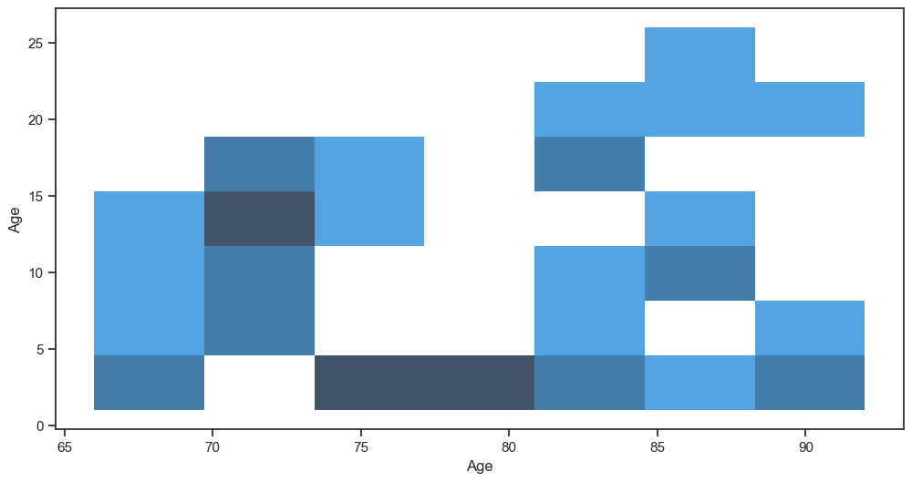
    


```python
# look at individuals in the nondemented group
nondemented_df = df[df['alz']==0]
nondemented_df.describe()
```


```python
males_df = df[df['gender'] == 1]
value_counts = males_df['alz'].value_counts()
print(value_counts)
```

    2    86
    0    61
    1    13
    Name: alz, dtype: int64


```python
females_df = df[df['gender'] == 2]
value_counts = females_df['alz'].value_counts()
print(value_counts)
```

    0    129
    2     60
    1     24
    Name: alz, dtype: int64


