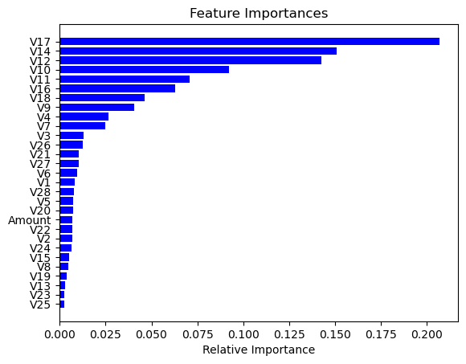
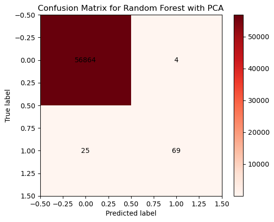
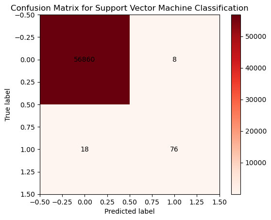

<a href="https://github.com/barbara-benitez/barbara-benitez.github.io/tree/master2/bbankproj">LINK_TEXT</a>

# Portfolio


### Learn About My Projects
This a showcase of some of the interesting projects I have worked on using machine learning.

### Credit Card Fraud Detection: Do banks want to save some money?


<span style="font-size: small; text-align: right;">


Fraud is a costly part of the credit card industry. In fact, in 2022, the Nilson Report, a major publication which provides data for the banking industry, forecast that the U.S. should expect a total loss of  $165.1 billion over the next 10 years due to fraudulent charges.

Bank ABC wants to improve its ability to recognize if a transaction is fraudulent. As a data scientist, I am tasked with finding a trackable
approach to improving the current process in place. 

My goal is to find a robust algorithm that can identify suspicious transactions and minimize expense to the company. 

### Solving the problem

This problem will be approached using several supervised learning algorithms. Because a small number of transactions are fraudulent (only 0.17% of the transactions), it would be quite reasonable to just assume that all are legitimate from a probabilistic point of view, but it is costly to work from such a position. Instead, the more conservative route would be to best predict transactions that are suspicious without impacting most transactions. Ideally, the process of identification would capture as many truly fraudulent transactions while minimizing those which are falsely marked as fraudulent. 

### Metrics Used for Evaluation

**Confusion Matrix**

The confusion matrix is a valuable tool for evaluating the performance of classification models. It provides a clear representation of the relationship between predicted and actual values, enabling the calculation of various metrics such as accuracy, precision, recall, and F1 score.
  
|                 | Predicted Negative | Predicted Positive   |
|-----------------|--------------------|----------------------|
| Actual Negative | True Negative (TN)  | False Positive (FP) |
| Actual Positive | False Negative (FN) | True Positive (TP)  |

  
 In a confusion matrix, the predicted values are listed in the columns, and the actual values are listed in the rows. The four main components of a confusion matrix are:

-True Negative (TN): The number of correctly predicted negative instances.\
-False Positive (FP): The number of incorrectly predicted positive instances.\
-False Negative (FN): The number of incorrectly predicted negative instances.\
-True Positive (TP): The number of correctly predicted positive instances.
  
 
  
**Model Accuracy**
  
$$\text{Accuracy} = \frac{TN+TP}{N}$$
    where $N$ is the sample size 
  
**Model Precision**
$$ \text{Precision} =\frac{TN}{TN+ FP}$$
The precision of the model is also known as the positive predictive value of the model. It represents the proportion of positive values that were correctly predicted. 

**Type II errors**
$$ \text{Probability of making a Type II error} =\frac{FN}{FN+ TP}$$
 
A type II error is an error where the model incorrectly predicts a false negative. It represents the proportion of negative values that were incorrectly predicted.

This type of error is costly as it results in inaction when there should have been a response.


## The Data
The datasest was made up of 284,807 rows of data with 31 columns. These data were credit card transactions, and the column names were labeled as V1, V2, $\ldots$, V28, amount and class. The class column is a represents whether or not the purchase was fraudulent--1 for fraudulent, 0 for non-fraudulent.


 
## Classification Models Explored  
## Table of Contents

- [Logistic Regression Model](#lg)
- [Decision Tree Model](#dt)
- [Random Forest Model](#rf)
- [Random Forest Model with PCA](#sectionrf_pca)
- [SVM Model](#svm)

### Bank Fraud Protection II

1. Logistic Regression Model
2. Decision Tree Model
3. Random Forest Model
4. Random Forest Model with PCA
5. SVM Model

### The process
## Loaded the libraries needed to classify the transactions.


```python
import pandas as pd
import numpy as np
import seaborn as sns
import matplotlib.pyplot as plt
from sklearn.pipeline import Pipeline
from sklearn.preprocessing import StandardScaler
from sklearn.tree import DecisionTreeClassifier
from sklearn.decomposition import PCA
from sklearn.ensemble import RandomForestClassifier
from sklearn.linear_model import LogisticRegression
from sklearn.model_selection import train_test_split
from sklearn.metrics import classification_report
from sklearn.metrics import accuracy_score
from sklearn.metrics import confusion_matrix
from sklearn.svm import SVC
```

## Upload the dataset (previously downloaded from Kaggle)


```python
df = pd.read_csv("creditcard.csv")
#
# make a clean copy of the data
df_unprocessed = df.copy()
```

# Preprocessing steps 
1. Basic look at the DataFrame
2. Handle missing values (none)
3. Eliminate irrelevant data (eliminate time column)
4. Rescale the numeric data (this will be done as part of a pipeline)
5. Convert categorical data (none)

# Basic look at the DataFrame


```python
df.shape
```


    (284807, 31)


## Get column names, basic datatypes and null-info for each column


```python
df.info()
```

    <class 'pandas.core.frame.DataFrame'>
    RangeIndex: 284807 entries, 0 to 284806
    Data columns (total 31 columns):
     #   Column  Non-Null Count   Dtype  
    ---  ------  --------------   -----  
     0   Time    284807 non-null  float64
     1   V1      284807 non-null  float64
     2   V2      284807 non-null  float64
     3   V3      284807 non-null  float64
     4   V4      284807 non-null  float64
     5   V5      284807 non-null  float64
     6   V6      284807 non-null  float64
     7   V7      284807 non-null  float64
     8   V8      284807 non-null  float64
     9   V9      284807 non-null  float64
     10  V10     284807 non-null  float64
     11  V11     284807 non-null  float64
     12  V12     284807 non-null  float64
     13  V13     284807 non-null  float64
     14  V14     284807 non-null  float64
     15  V15     284807 non-null  float64
     16  V16     284807 non-null  float64
     17  V17     284807 non-null  float64
     18  V18     284807 non-null  float64
     19  V19     284807 non-null  float64
     20  V20     284807 non-null  float64
     21  V21     284807 non-null  float64
     22  V22     284807 non-null  float64
     23  V23     284807 non-null  float64
     24  V24     284807 non-null  float64
     25  V25     284807 non-null  float64
     26  V26     284807 non-null  float64
     27  V27     284807 non-null  float64
     28  V28     284807 non-null  float64
     29  Amount  284807 non-null  float64
     30  class   284807 non-null  int64  
    dtypes: float64(30), int64(1)
    memory usage: 67.4 MB


There are 31 columns of data with 284,807 rows. All datatypes are float, except the target variable which is coded as an integer datatype.

## Check for missing values


```python
df.isnull().sum().sum()
```


    0


There were no missing data values in any of the columns! Forge on!

## Look the target data 
(coding 0 -  legitimate transaction, 1 - fraudulent transaction)


```python
df["class"].value_counts()
```


    0    284315
    1       492
    Name: class, dtype: int64


Nearly all of the transactions are legitimate so this makes the detection of fraudulent transactions tricky. 

Even if we assume that all of the transactions are legitimate, the probability of making a mistake is really small so this won't be the best way to measure success. 

Instead, we will think about the classification problem in terms of minimizing loss to the company, or minimizing the likelihood of a Type II error: incorrectly allowing a fraudulent transaction to be processed.


```python
df.describe()
```


<table border="1" class="dataframe">
  <thead>
    <tr style="text-align: right;">
      <th></th>
      <th>Time</th>
      <th>V1</th>
      <th>V2</th>
      <th>V3</th>
      <th>V4</th>
      <th>V5</th>
      <th>V6</th>
      <th>V7</th>
      <th>V8</th>
      <th>V9</th>
      <th>...</th>
      <th>V21</th>
      <th>V22</th>
      <th>V23</th>
      <th>V24</th>
      <th>V25</th>
      <th>V26</th>
      <th>V27</th>
      <th>V28</th>
      <th>Amount</th>
      <th>class</th>
    </tr>
  </thead>
  <tbody>
    <tr>
      <th>count</th>
      <td>284807.000000</td>
      <td>2.848070e+05</td>
      <td>2.848070e+05</td>
      <td>2.848070e+05</td>
      <td>2.848070e+05</td>
      <td>2.848070e+05</td>
      <td>2.848070e+05</td>
      <td>2.848070e+05</td>
      <td>2.848070e+05</td>
      <td>2.848070e+05</td>
      <td>...</td>
      <td>2.848070e+05</td>
      <td>2.848070e+05</td>
      <td>2.848070e+05</td>
      <td>2.848070e+05</td>
      <td>2.848070e+05</td>
      <td>2.848070e+05</td>
      <td>2.848070e+05</td>
      <td>2.848070e+05</td>
      <td>284807.000000</td>
      <td>284807.000000</td>
    </tr>
    <tr>
      <th>mean</th>
      <td>94813.859575</td>
      <td>1.759061e-12</td>
      <td>-8.251130e-13</td>
      <td>-9.654937e-13</td>
      <td>8.321385e-13</td>
      <td>1.649999e-13</td>
      <td>4.248366e-13</td>
      <td>-3.054600e-13</td>
      <td>8.777971e-14</td>
      <td>-1.179749e-12</td>
      <td>...</td>
      <td>-3.405756e-13</td>
      <td>-5.723197e-13</td>
      <td>-9.725856e-13</td>
      <td>1.464150e-12</td>
      <td>-6.987102e-13</td>
      <td>-5.617874e-13</td>
      <td>3.332082e-12</td>
      <td>-3.518874e-12</td>
      <td>88.349619</td>
      <td>0.001727</td>
    </tr>
    <tr>
      <th>std</th>
      <td>47488.145955</td>
      <td>1.958696e+00</td>
      <td>1.651309e+00</td>
      <td>1.516255e+00</td>
      <td>1.415869e+00</td>
      <td>1.380247e+00</td>
      <td>1.332271e+00</td>
      <td>1.237094e+00</td>
      <td>1.194353e+00</td>
      <td>1.098632e+00</td>
      <td>...</td>
      <td>7.345240e-01</td>
      <td>7.257016e-01</td>
      <td>6.244603e-01</td>
      <td>6.056471e-01</td>
      <td>5.212781e-01</td>
      <td>4.822270e-01</td>
      <td>4.036325e-01</td>
      <td>3.300833e-01</td>
      <td>250.120109</td>
      <td>0.041527</td>
    </tr>
    <tr>
      <th>min</th>
      <td>0.000000</td>
      <td>-5.640751e+01</td>
      <td>-7.271573e+01</td>
      <td>-4.832559e+01</td>
      <td>-5.683171e+00</td>
      <td>-1.137433e+02</td>
      <td>-2.616051e+01</td>
      <td>-4.355724e+01</td>
      <td>-7.321672e+01</td>
      <td>-1.343407e+01</td>
      <td>...</td>
      <td>-3.483038e+01</td>
      <td>-1.093314e+01</td>
      <td>-4.480774e+01</td>
      <td>-2.836627e+00</td>
      <td>-1.029540e+01</td>
      <td>-2.604551e+00</td>
      <td>-2.256568e+01</td>
      <td>-1.543008e+01</td>
      <td>0.000000</td>
      <td>0.000000</td>
    </tr>
    <tr>
      <th>25%</th>
      <td>54201.500000</td>
      <td>-9.203734e-01</td>
      <td>-5.985499e-01</td>
      <td>-8.903648e-01</td>
      <td>-8.486401e-01</td>
      <td>-6.915971e-01</td>
      <td>-7.682956e-01</td>
      <td>-5.540759e-01</td>
      <td>-2.086297e-01</td>
      <td>-6.430976e-01</td>
      <td>...</td>
      <td>-2.283949e-01</td>
      <td>-5.423504e-01</td>
      <td>-1.618463e-01</td>
      <td>-3.545861e-01</td>
      <td>-3.171451e-01</td>
      <td>-3.269839e-01</td>
      <td>-7.083953e-02</td>
      <td>-5.295979e-02</td>
      <td>5.600000</td>
      <td>0.000000</td>
    </tr>
    <tr>
      <th>50%</th>
      <td>84692.000000</td>
      <td>1.810880e-02</td>
      <td>6.548556e-02</td>
      <td>1.798463e-01</td>
      <td>-1.984653e-02</td>
      <td>-5.433583e-02</td>
      <td>-2.741871e-01</td>
      <td>4.010308e-02</td>
      <td>2.235804e-02</td>
      <td>-5.142873e-02</td>
      <td>...</td>
      <td>-2.945017e-02</td>
      <td>6.781943e-03</td>
      <td>-1.119293e-02</td>
      <td>4.097606e-02</td>
      <td>1.659350e-02</td>
      <td>-5.213911e-02</td>
      <td>1.342146e-03</td>
      <td>1.124383e-02</td>
      <td>22.000000</td>
      <td>0.000000</td>
    </tr>
    <tr>
      <th>75%</th>
      <td>139320.500000</td>
      <td>1.315642e+00</td>
      <td>8.037239e-01</td>
      <td>1.027196e+00</td>
      <td>7.433413e-01</td>
      <td>6.119264e-01</td>
      <td>3.985649e-01</td>
      <td>5.704361e-01</td>
      <td>3.273459e-01</td>
      <td>5.971390e-01</td>
      <td>...</td>
      <td>1.863772e-01</td>
      <td>5.285536e-01</td>
      <td>1.476421e-01</td>
      <td>4.395266e-01</td>
      <td>3.507156e-01</td>
      <td>2.409522e-01</td>
      <td>9.104512e-02</td>
      <td>7.827995e-02</td>
      <td>77.165000</td>
      <td>0.000000</td>
    </tr>
    <tr>
      <th>max</th>
      <td>172792.000000</td>
      <td>2.454930e+00</td>
      <td>2.205773e+01</td>
      <td>9.382558e+00</td>
      <td>1.687534e+01</td>
      <td>3.480167e+01</td>
      <td>7.330163e+01</td>
      <td>1.205895e+02</td>
      <td>2.000721e+01</td>
      <td>1.559499e+01</td>
      <td>...</td>
      <td>2.720284e+01</td>
      <td>1.050309e+01</td>
      <td>2.252841e+01</td>
      <td>4.584549e+00</td>
      <td>7.519589e+00</td>
      <td>3.517346e+00</td>
      <td>3.161220e+01</td>
      <td>3.384781e+01</td>
      <td>25691.160000</td>
      <td>1.000000</td>
    </tr>
  </tbody>
</table>
<p>8 rows × 31 columns</p>
</div>


The data values are on vary different scales. They will need rescaling prior to running through the classification algorithms.

## Drop the "Time" column from the data. 
It does not have a meaning that is easily understood from the data.


```python
df = df.drop('Time', axis=1)
```

## Split the data: training data versus test data
### The target data is in the last column of the data, labeled "class"


```python
X = df.iloc[:, :-1]
y = df.iloc[:, -1]
```


```python
X_train, X_test, y_train, y_test = train_test_split(X, y, test_size = .2, random_state =10)
```

Verify that the new arrays for the training data are appropriately sized.


```python
X_train.shape
```


    (227845, 29)


```python
y_train.shape
```


    (227845,)


## Logistic Regression model {#lg}

```python
pipeline_logistic = Pipeline([
    ("Scaler", StandardScaler()),
    ("Logistic Regression", LogisticRegression(max_iter=1000))
])
print(pipeline_logistic)
```

```python
Pipeline(steps=[('Scaler', StandardScaler()),
                    ('Logistic Regression', LogisticRegression(max_iter=1000))])
```


```python
pipeline_logistic.fit(X_train, y_train)
```


```python
pipeline_logistic.score(X_test, y_test)
```


```python
 0.9992977774656788
```


```python
# generate confusion matrix for logistic regression model
y_pred_logistic = pipeline_logistic.predict(X_test)
confusion_lg = confusion_matrix(y_test, y_pred_logistic)
confusion_lg
```


    array([[56859,     9],
           [   31,    63]])


```python
typeII_lg = confusion_lg[1,0] / ( confusion_lg[1,0] + confusion_lg[0,1])
```


```python
print("Logistic regression: the number of predicted type II errors is :, FN = ", confusion_lg[1, 0])
print()
print("This means that out of the ",confusion_lg[1,0]+confusion_lg[0,1]," total errors, ",
      typeII_lg, "percent are Type II errors.")
```

  ##  Logistic regression: the number of predicted type II errors is : FN =  31
    
    This means that out of the  40  total errors,  0.775 percent are Type II errors.


```python
print("Type II errors by model:")
print("Logistic Regression: ", typeII_lg)
```

   ## Type II errors by model:
   ## Logistic Regression:  0.775


```python
plt.imshow(confusion_lg, cmap='Reds')
# Add colorbar
cbar = plt.colorbar()
# Set labels and title
plt.xlabel("Predicted label")
plt.ylabel("True label")
plt.title("Confusion Matrix for Logistic Regression")
# Add numeric labels to the plot
for i in range(confusion_lg.shape[0]):
    for j in range(confusion_lg.shape[1]):
        plt.text(j, i, confusion_lg[i, j], ha="center", va="center", color="k")

# Show the plot
plt.show()
```


    

    


## Random Forest Classification Model  {#rf}


```python
model_random_forest = RandomForestClassifier( criterion = 'gini',
                                            max_depth = 8, # max depth of the tree
                                            min_samples_split = 10, # min no of samples to check
                                            random_state =5)
model_random_forest.fit(X_train, y_train)
```


```python
y_pred_rf = model_random_forest.predict(X_test) 
```

## Look at the important features


```python
print(df.columns)
model_random_forest.feature_importances_
```

    Index(['V1', 'V2', 'V3', 'V4', 'V5', 'V6', 'V7', 'V8', 'V9', 'V10', 'V11',
           'V12', 'V13', 'V14', 'V15', 'V16', 'V17', 'V18', 'V19', 'V20', 'V21',
           'V22', 'V23', 'V24', 'V25', 'V26', 'V27', 'V28', 'Amount', 'class'],
          dtype='object')


    array([0.00842184, 0.0067615 , 0.01288664, 0.02658881, 0.00726395,
           0.00955841, 0.02468218, 0.00479116, 0.04078178, 0.09228906,
           0.07068483, 0.14246561, 0.0028285 , 0.15091562, 0.00507509,
           0.06294059, 0.20666051, 0.04620446, 0.00395223, 0.00723532,
           0.01058561, 0.00690721, 0.00255953, 0.00644772, 0.00246227,
           0.01278861, 0.0103704 , 0.00783888, 0.00705167])


## Look at the accuracy of the model


```python
rf_accuracy = accuracy_score(y_test, y_pred_rf)
```


```python
print("Random Forest Model Accuracy: ", rf_accuracy)
```

    Random Forest Model Accuracy:  0.9996313331694814


```python
features = df.columns
importances = model_random_forest.feature_importances_
indices = np.argsort(importances)

plt.title('Feature Importances')
plt.barh(range(len(indices)), importances[indices], 
         color = 'b', align = 'center')
plt.yticks(range(len(indices)), [features[i] for i in indices])
plt.xlabel("Relative Importance")
plt.show()
```


    

    


There are approximately 6 features that really impact the classification

## Run classification report for Random Forest Model


```python
print(classification_report(y_test, y_pred_rf))
```

                  precision    recall  f1-score   support
    
               0       1.00      1.00      1.00     56868
               1       0.99      0.79      0.88        94
    
        accuracy                           1.00     56962
       macro avg       0.99      0.89      0.94     56962
    weighted avg       1.00      1.00      1.00     56962
    


```python
# generate a confusion matrix for the results of Random Forest
confusion_rf = confusion_matrix(y_test, y_pred_rf)
confusion_rf
```


    array([[56867,     1],
           [   20,    74]])


```python
typeII_rf = confusion_rf[1,0] / ( confusion_rf[1,0]+confusion_rf[0,1])
```


```python
print("Random forest classification: the number of predicted type II errors is :, FN = ", confusion_rf[1, 0])
print()
print("This means that out of the ",confusion_rf[1,0]+confusion_rf[0,1]," total errors, ",  
     typeII_rf , "percent are Type II errors.")
```

    Random forest classification: the number of predicted type II errors is :, FN =  20
    
    This means that out of the  21  total errors,  0.9523809523809523 percent are Type II errors.


```python
print("Type II errors by model:")
print("Logistic Regression: ", typeII_lg)
print("Random Forest: ", typeII_rf)
```

    Type II errors by model:
    Logistic Regression:  0.775
    Random Forest:  0.9523809523809523


```python
plt.imshow(confusion_rf, cmap='Reds')
# Add colorbar
cbar = plt.colorbar()
# Set labels and title
plt.xlabel("Predicted label")
plt.ylabel("True label")
plt.title("Confusion Matrix for Random Forest")
# Add numeric labels to the plot
for i in range(confusion_rf.shape[0]):
    for j in range(confusion_rf.shape[1]):
        plt.text(j, i, confusion_rf[i, j], ha="center", va="center", color="k")

# Show the plot
plt.show()
```


    

    


## Random Forest with PCA to see if the model improves {#rf_pca}


```python
pipeline_rf_pca = Pipeline([
    ('Scaler', StandardScaler()),
    ('PCA', PCA(n_components = 6)),
    ("Random Forest", RandomForestClassifier( criterion = 'gini',
                                            max_depth = 8, # max depth of the tree
                                            min_samples_split = 10, # min no of samples to check
                                            random_state =5))
])
```


```python
pipeline_rf_pca
```


```python
pipeline_rf_pca.fit(X_train, y_train)
```


```python
rf_PCA_accuracy =  pipeline_rf_pca.score(X_test, y_test)
```

Determine which model has a higher accuracy score: Random forest with or without PCA


```python
rf_PCA_accuracy > rf_accuracy
```


```python
    False
````


### Turns out that the random forest model accuracy was higher without PCA.

## Check the confusion matrix just the same to see the breakdown of type I versus type II errors


```python
y_pred_rf_pca = pipeline_rf_pca.predict(X_test)
```


```python
confusion_rf_pca = confusion_matrix(y_test, y_pred_rf_pca)
confusion_rf_pca
```


    array([[56864,     4],
           [   25,    69]])


```python
typeII_rf_pca = confusion_rf_pca[1,0] / ( confusion_rf_pca[1,0]+confusion_rf_pca[0,1])
```


```python
print("Random forest classification with PCA: the number of predicted type II errors is :, FN = ", confusion_rf_pca[1, 0])
print()
print("This means that out of the ",confusion_rf_pca[1,0]+confusion_rf_pca[0,1]," total errors, ",
      typeII_rf_pca, "percent are Type II errors.")
```

    Random forest classification with PCA: the number of predicted type II errors is :, FN =  25
    
    This means that out of the  29  total errors,  0.8620689655172413 percent are Type II errors.


This means that, although the overall accuracy of the model decreased, the overall number of costly Type II errors was decreased. Applying the PCA to the Random Forest model was a good move in actuality.


```python
print("Type II errors by model:")
print("Logistic Regression: ", typeII_lg)
print("Random Forest: ", typeII_rf)
print("Random Forest with PCA: ", typeII_rf_pca)      
```

    Type II errors by model:
    Logistic Regression:  0.775
    Random Forest:  0.9523809523809523
    Random Forest with PCA:  0.8620689655172413


```python
plt.imshow(confusion_rf_pca, cmap='Reds')
# Add colorbar
cbar = plt.colorbar()
# Set labels and title
plt.xlabel("Predicted label")
plt.ylabel("True label")
plt.title("Confusion Matrix for Random Forest with PCA")
# Add numeric labels to the plot
for i in range(confusion_rf_pca.shape[0]):
    for j in range(confusion_rf_pca.shape[1]):
        plt.text(j, i, confusion_rf_pca[i, j], ha="center", va="center", color="k")

# Show the plot
plt.show()
```


    

    


## Use SVM to classify  {#svm}


```python
pipeline_SVC = Pipeline([
    ("Scaler", StandardScaler()),
    ("SVM", SVC(kernel = 'linear', 
               C=1.0))
])
```


```python
pipeline_SVC
```


```python
pipeline_SVC.fit(X_train, y_train)
```


```python
pipeline_SVC.score(X_test, y_test)
```


    0.9995435553526912


```python
# produce confusion matrix
y_pred_SVC = pipeline_SVC.predict(X_test)
confusion_SVC = confusion_matrix(y_test, y_pred_SVC)
confusion_SVC 
```


    array([[56860,     8],
           [   18,    76]])


```python
typeII_SVC = confusion_SVC[1,0] / ( confusion_SVC[1,0] + confusion_SVC[0,1])
```


```python
print("Support Vector Machine: the number of predicted type II errors is :, FN = ", confusion_SVC[1, 0])
print()
print("This means that out of the ",confusion_SVC[1,0]+confusion_SVC[0,1]," total errors, ",
      typeII_SVC, "percent are Type II errors.")
```

    Support Vector Machine: the number of predicted type II errors is :, FN =  18
    
    This means that out of the  26  total errors,  0.6923076923076923 percent are Type II errors.


```python
print("Type II errors by model:")
print("Logistic Regression: ", typeII_lg)
print("Random Forest: ", typeII_rf)
print("Random Forest with PCA: ", typeII_rf_pca) 
print("SVC: ", typeII_SVC)
```

    Type II errors by model:
    Logistic Regression:  0.775
    Random Forest:  0.9523809523809523
    Random Forest with PCA:  0.8620689655172413
    SVC:  0.6923076923076923


## The support vector machine algorithm actually had the lowest Type II errors so it would generally be preferable for predicting fraudulent charges based on this dataset.


```python
plt.imshow(confusion_SVC, cmap='Reds')
# Add colorbar
cbar = plt.colorbar()
# Set labels and title
plt.xlabel("Predicted label")
plt.ylabel("True label")
plt.title("Confusion Matrix for Support Vector Machine Classification")
# Add numeric labels to the plot
for i in range(confusion_SVC.shape[0]):
    for j in range(confusion_SVC.shape[1]):
        plt.text(j, i, confusion_SVC[i, j], ha="center", va="center", color="k")

# Show the plot
plt.show()
```



    


Compute the probability of a fraudulent transaction, p, based on this dataset. 
p = no of fraudulent transactions / no of total transactions


```python
nonzero_count = np.count_nonzero(df["class"])
```


```python
total_rows = df.shape[0]
# Calculate the ratio of nonzero values to the total number of rows
p_fraud = nonzero_count / total_rows
print("The probability of a fraudulent transaction is :", p_fraud)
```

    The probability of a fraudulent transaction is : 0.001727485630620034


## Compute the expected value of a transaction
Since the credit card company charges a fee of 1-3% for the use of a credit card, we will assume that the rate is 2% for simplicity. 

Now the expected value is broken into two parts:
1. If the transaction is valid and approved, then the company will make 0.02* amount of the transaction.
2. If the transaction is fraudulent and approved, then the company will be liable for the full amount of the transaction and will not be paid a charge for the transaction. 

### E = (1-p_fraud) * fee_charge * amount -  p_fraud * (amount)


```python
# Calculate the net expected profit for 
expected_value = sum(df.apply(lambda row: (row["Amount"] * 0.02 * (1 - p_fraud))-(row["Amount"] * p_fraud),
                              axis=1))

# Output the result
print("The expected value of the actual transactions is: $", "{:.2f}".format(expected_value))
print()
print('That is, based on the current means for identifying fraudulent transactions, the net expected "profit" \n\
    to the credit card company should be approximately $', "{:.2f}".format(expected_value), 
      "using the provided transaction amounts and the current number of fraudulent charges.")
```

    The expected value of the actual transactions is: $ 458914.43
    
    That is, based on the current means for identifying fraudulent transactions, the net expected "profit" 
        to the credit card company should be approximately $ 458914.43 using the provided transaction amounts and the current number of fraudulent charges.


## Given the adoption of the SVC model, we define the probability of missing a fraudelent charge to be p_fraud_new


```python
p_fraud_new = confusion_SVC[1,0] / total_rows

# Verify that the new likelihood of detecting the fraudulent charges is lower.
p_fraud_new < p_fraud
```


    True


# Calculate the revised expected profit based on the improved detection 


```python
expected_value_new = sum(df.apply(lambda row: (row["Amount"] * 0.02 * (1 - p_fraud_new))-\
                                  (row["Amount"] * p_fraud_new),
                              axis=1))

print("The improved net expected profit based on the provided transactions would be $", \
      "{:.2f}".format(expected_value_new))
```

    The improved net expected profit based on the provided transactions would be $ 501629.70


```python
# compute the increase in net profit
profit_incr = expected_value_new - expected_value
print("The increase in net profit would be $",  "{:.2f}".format(profit_incr))
```

    The increase in net profit would be $ 42715.27


  
#### [Internal Blog Post Project](/bank)
What happens if I add info here?

Tolulope is the best

---
#### [Linked File Project](/files/Day 12 - 21 days to data.pdf)

For this project, I explored what a good analytics PowerPoint presentation should entail. It talks about main talking points, how to tie data to the business value, and much more. 

---
#### [External Link Project](https://www.linkedin.com/pulse/what-i-learned-21-days-data-avery-smith)
[](https://www.linkedin.com/pulse/what-i-learned-21-days-data-avery-smith)
My final write up for Avery Smith's 21 Days To Data project covering New York City crime data. 


---
#### [Education Project](https://www.linkedin.com/pulse/massachusetts-education-analysis-samantha-paul/)
[](https://www.linkedin.com/pulse/what-i-learned-21-days-data-avery-smith)
In this case study from Data Analytics Accelerator, I was prompted to analyze the State of Massachusetts education data. The main focuses were:
What schools are struggling the most?
How does class size affect college admission?
What are the top math schools in the state? 

---

### Category Name 2

- [Project 1 Title](http://example.com/)
- [Project 2 Title](http://example.com/)
- [Project 3 Title](http://example.com/)
- [Project 4 Title](http://example.com/)
- [Project 5 Title](http://example.com/)

---


